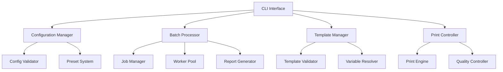

# Enhanced CLI Printing System - Developer Design Document

## Overview

This document outlines the design and implementation requirements for enhancing the Printeer CLI package to support comprehensive printing configurations, batch processing, and professional web-to-print capabilities following industry best practices.

## Table of Contents

- [Current State Analysis](#current-state-analysis)
- [Enhancement Requirements](#enhancement-requirements)
- [Architecture Design](#architecture-design)
- [Configuration System](#configuration-system)
- [Batch Processing System](#batch-processing-system)
- [Template Management](#template-management)
- [CLI Interface Enhancement](#cli-interface-enhancement)
- [Implementation Plan](#implementation-plan)
- [API Specifications](#api-specifications)
- [File Structure](#file-structure)
- [Testing Strategy](#testing-strategy)

## Current State Analysis

### Existing Capabilities
- Basic web-to-PDF/PNG conversion
- Adaptive CLI with interactive and stdio modes
- Simple output format detection
- Basic system diagnostics (doctor command)
- Environment-aware execution

### Limitations Identified
1. **Limited Print Configuration**: Only basic format and output type support
2. **No Batch Processing**: Single URL processing only
3. **Missing Template System**: No header/footer template support
4. **Basic Configuration**: No preset or advanced configuration management
5. **Limited Wait Conditions**: Basic wait strategies only
6. **No Authentication Support**: Missing auth headers and cookies
7. **Limited Quality Controls**: No viewport, scale, or quality options

## Enhancement Requirements

### R1: Comprehensive Print Configuration System
**Priority**: High
**Description**: Implement a comprehensive configuration system supporting all professional printing options.

**Technical Requirements**:
- Support for all standard page formats (A4, A3, Letter, Legal, Custom)
- Margin control (individual sides or unified)
- PDF-specific options (background, headers/footers, tagged PDFs)
- Image-specific options (quality, clipping, encoding)
- Viewport and device emulation
- Media type emulation (screen/print)
- Authentication and custom headers
- Performance optimization controls

### R2: Batch Processing System
**Priority**: High
**Description**: Implement parallel batch processing with job management and reporting.

**Technical Requirements**:
- Support for CSV, JSON, and YAML batch files
- Parallel processing with configurable concurrency
- Job dependency management
- Progress tracking and reporting
- Error handling and retry logic
- Output organization and naming patterns
- Comprehensive batch reports

### R3: Template Management System
**Priority**: Medium
**Description**: Implement a template system for headers, footers, and dynamic content.

**Technical Requirements**:
- Template file support (HTML with variables)
- Built-in template library
- Variable substitution system
- Template validation and preview
- Template sharing and management

### R4: Enhanced CLI Interface
**Priority**: High
**Description**: Extend the CLI with new commands and comprehensive options.

**Technical Requirements**:
- Enhanced convert command with all configuration options
- New batch processing command
- Configuration management commands
- Template management commands
- Interactive configuration wizard
- Backward compatibility with existing CLI

### R5: Configuration File System
**Priority**: Medium
**Description**: Implement a robust configuration file system with validation and presets.

**Technical Requirements**:
- Multiple configuration file formats (JSON, YAML)
- Configuration validation with detailed error messages
- Preset management system
- Configuration inheritance and merging
- Environment-specific configurations

## Architecture Design

### System Components



### Module Responsibilities

#### Configuration Manager (`src/config/enhanced-config.ts`)
- Load and validate configuration files
- Manage configuration presets
- Handle configuration inheritance and merging
- Provide configuration schema validation

#### Batch Processor (`src/batch/batch-processor.ts`)
- Parse batch files (CSV, JSON, YAML)
- Manage job queues and dependencies
- Execute parallel processing
- Generate comprehensive reports

#### Template Manager (`src/templates/template-manager.ts`)
- Load and validate HTML templates
- Handle variable substitution
- Manage built-in and custom templates
- Provide template preview capabilities

#### Print Controller (`src/printing/enhanced-controller.ts`)
- Orchestrate the printing process
- Apply configurations to print engine
- Handle quality control and validation
- Manage output file organization

## Configuration System

### Configuration Schema

```typescript
export interface EnhancedPrintConfiguration {
  // Page Settings
  page: {
    format: PageFormat | { width: string | number; height: string | number };
    orientation: 'portrait' | 'landscape';
    margins: MarginConfig;
  };

  // PDF Specific Options
  pdf: {
    printBackground: boolean;
    displayHeaderFooter: boolean;
    headerTemplate?: string;
    footerTemplate?: string;
    preferCSSPageSize: boolean;
    generateTaggedPDF: boolean;
    scale: number;
    omitBackground: boolean;
    outline: boolean;
    metadata?: PDFMetadata;
  };

  // Image Options
  image: {
    fullPage: boolean;
    clip?: ClipRegion;
    quality: number;
    type: 'png' | 'jpeg' | 'webp';
    encoding: 'base64' | 'binary';
    optimizeForSize: boolean;
  };

  // Viewport Settings
  viewport: {
    width: number;
    height: number;
    deviceScaleFactor: number;
    isMobile: boolean;
    hasTouch: boolean;
    isLandscape: boolean;
  };

  // Wait Conditions
  wait: {
    until: WaitCondition;
    timeout: number;
    selector?: string;
    delay?: number;
    customFunction?: string;
    stabilityCheck?: {
      enabled: boolean;
      threshold: number;
      timeout: number;
    };
  };

  // Authentication & Headers
  auth: {
    basic?: { username: string; password: string };
    headers?: Record<string, string>;
    cookies?: CookieConfig[];
    userAgent?: string;
  };

  // Media & Emulation
  emulation: {
    mediaType: 'screen' | 'print';
    colorScheme: 'light' | 'dark' | 'no-preference';
    reducedMotion: 'reduce' | 'no-preference';
    timezone?: string;
    locale?: string;
    geolocation?: { latitude: number; longitude: number; accuracy: number };
  };

  // Performance & Quality
  performance: {
    blockResources: ResourceType[];
    maxConcurrent: number;
    retryAttempts: number;
    cacheEnabled: boolean;
    javascriptEnabled: boolean;
    loadTimeout: number;
    networkThrottling?: NetworkThrottling;
  };
}
```

### Configuration File Examples

#### Basic Configuration (`printeer.config.json`)
```json
{
  "$schema": "./node_modules/printeer/schemas/config.schema.json",
  "defaults": {
    "page": {
      "format": "A4",
      "orientation": "portrait",
      "margins": "1in"
    },
    "pdf": {
      "printBackground": true,
      "scale": 0.8
    },
    "wait": {
      "until": "networkidle0",
      "timeout": 30000
    }
  },
  "presets": {
    "invoice": {
      "extends": "defaults",
      "page": { "format": "A4" },
      "pdf": {
        "displayHeaderFooter": true,
        "headerTemplate": "invoice-header",
        "footerTemplate": "invoice-footer"
      },
      "emulation": { "mediaType": "print" }
    },
    "screenshot": {
      "extends": "defaults",
      "image": {
        "fullPage": true,
        "quality": 90,
        "type": "png"
      },
      "emulation": { "mediaType": "screen" }
    }
  }
}
```

#### Advanced Configuration with Environment Overrides
```yaml
# printeer.config.yaml
defaults: &defaults
  page:
    format: A4
    orientation: portrait
    margins:
      top: 1in
      right: 0.75in
      bottom: 1in
      left: 0.75in

  pdf:
    printBackground: true
    scale: 0.8
    generateTaggedPDF: false

  wait:
    until: networkidle0
    timeout: 30000
    stabilityCheck:
      enabled: true
      threshold: 500
      timeout: 5000

environments:
  development:
    <<: *defaults
    performance:
      cacheEnabled: false
      javascriptEnabled: true

  production:
    <<: *defaults
    performance:
      cacheEnabled: true
      blockResources: ['font', 'image']
      maxConcurrent: 5
    pdf:
      generateTaggedPDF: true

presets:
  invoice:
    page: { format: A4 }
    pdf:
      displayHeaderFooter: true
      headerTemplate: "{{templates.invoice-header}}"
      footerTemplate: "{{templates.invoice-footer}}"
    emulation: { mediaType: print }

  report:
    page:
      format: A3
      orientation: landscape
    pdf:
      scale: 0.7
      outline: true
```

### Configuration Manager Implementation

```typescript
// src/config/enhanced-config.ts
import { cosmiconfig } from 'cosmiconfig';
import Ajv from 'ajv';
import addFormats from 'ajv-formats';
import { merge } from 'lodash';
import configSchema from '../schemas/config.schema.json';

export class EnhancedConfigurationManager {
  private explorer = cosmiconfig('printeer');
  private validator: Ajv;
  private loadedConfig?: EnhancedPrintConfiguration;

  constructor() {
    this.validator = new Ajv({ allErrors: true });
    addFormats(this.validator);
    this.validator.addSchema(configSchema, 'config');
  }

  async loadConfiguration(
    configPath?: string,
    environment?: string
  ): Promise<EnhancedPrintConfiguration> {
    // Load configuration from file or search
    const result = configPath
      ? await this.explorer.load(configPath)
      : await this.explorer.search();

    if (!result?.config) {
      return this.getDefaultConfiguration();
    }

    // Validate configuration schema
    const isValid = this.validator.validate('config', result.config);
    if (!isValid) {
      throw new ConfigurationError(
        'Invalid configuration',
        this.validator.errors
      );
    }

    // Apply environment-specific overrides
    let config = result.config;
    if (environment && config.environments?.[environment]) {
      config = merge({}, config.defaults, config.environments[environment]);
    } else if (config.defaults) {
      config = config.defaults;
    }

    this.loadedConfig = config;
    return config;
  }

  async getPreset(name: string): Promise<Partial<EnhancedPrintConfiguration>> {
    if (!this.loadedConfig) {
      await this.loadConfiguration();
    }

    const preset = this.loadedConfig?.presets?.[name];
    if (!preset) {
      throw new Error(`Preset '${name}' not found`);
    }

    // Handle preset inheritance
    if (preset.extends) {
      const basePreset = await this.getPreset(preset.extends);
      return merge({}, basePreset, preset);
    }

    return preset;
  }

  validateConfiguration(config: any): ValidationResult {
    const isValid = this.validator.validate('config', config);
    return {
      valid: isValid,
      errors: this.validator.errors || [],
      formattedErrors: this.formatValidationErrors(this.validator.errors)
    };
  }

  private formatValidationErrors(errors?: ErrorObject[]): string[] {
    if (!errors) return [];

    return errors.map(error => {
      const path = error.instancePath || error.schemaPath;
      return `${path}: ${error.message}`;
    });
  }

  getBuiltInPresets(): Record<string, Partial<EnhancedPrintConfiguration>> {
    return {
      'web-article': {
        page: { format: 'A4', orientation: 'portrait' },
        pdf: { printBackground: true, scale: 0.8 },
        wait: { until: 'networkidle0', timeout: 30000 },
        emulation: { mediaType: 'screen' }
      },
      'mobile-responsive': {
        viewport: { width: 375, height: 667, isMobile: true },
        page: { format: 'A4' },
        emulation: { mediaType: 'screen' }
      },
      'print-optimized': {
        emulation: { mediaType: 'print', colorScheme: 'light' },
        pdf: { preferCSSPageSize: true, printBackground: false }
      },
      'high-quality': {
        image: { quality: 100, type: 'png' },
        viewport: { deviceScaleFactor: 2 },
        performance: { blockResources: [] }
      },
      'fast-batch': {
        performance: {
          blockResources: ['image', 'font', 'stylesheet'],
          maxConcurrent: 10,
          cacheEnabled: true
        },
        pdf: { printBackground: false, scale: 0.6 }
      }
    };
  }
}
```

## Batch Processing System

### Batch Job Schema

```typescript
// src/batch/types.ts
export interface BatchJob {
  id: string;
  url: string;
  output: string;
  config?: Partial<EnhancedPrintConfiguration>;
  preset?: string;
  variables?: Record<string, any>;
  metadata?: Record<string, any>;
  priority?: number;
  dependencies?: string[];
  retryCount?: number;
  timeout?: number;
}

export interface BatchOptions {
  concurrency: number;
  retryAttempts: number;
  continueOnError: boolean;
  outputDirectory: string;
  reportFormat: 'json' | 'csv' | 'html';
  progressTracking: boolean;
  dryRun: boolean;
  maxMemoryUsage?: string;
  cleanup: boolean;
}

export interface BatchResult {
  jobId: string;
  status: 'completed' | 'failed' | 'skipped';
  startTime: Date;
  endTime: Date;
  duration: number;
  outputFile?: string;
  error?: string;
  retryCount: number;
  memoryUsed?: number;
  pageMetrics?: {
    loadTime: number;
    resourceCount: number;
    totalSize: number;
  };
}
```

### Batch File Formats

#### CSV Format
```csv
# batch-jobs.csv
id,url,output,preset,variables,priority
invoice-001,https://example.com/invoice/1,invoices/invoice-001.pdf,invoice,"{""invoiceId"":""001""}",1
invoice-002,https://example.com/invoice/2,invoices/invoice-002.pdf,invoice,"{""invoiceId"":""002""}",1
report-monthly,https://example.com/reports/monthly,reports/monthly.pdf,report,"{""month"":""January""}",2
```

#### JSON Format
```json
{
  "metadata": {
    "name": "Monthly Batch Processing",
    "version": "1.0",
    "created": "2025-09-11T10:00:00Z"
  },
  "defaults": {
    "preset": "web-article",
    "outputDirectory": "./output",
    "timeout": 30000
  },
  "jobs": [
    {
      "id": "invoice-batch",
      "url": "https://example.com/invoice/{invoiceId}",
      "output": "invoices/invoice-{invoiceId}.pdf",
      "preset": "invoice",
      "variables": {
        "invoiceIds": ["001", "002", "003", "004"]
      },
      "priority": 1
    },
    {
      "id": "report-generation",
      "url": "https://example.com/reports/{reportType}",
      "output": "reports/{reportType}-report.pdf",
      "config": {
        "page": { "format": "A3", "orientation": "landscape" },
        "pdf": { "scale": 0.7 }
      },
      "variables": {
        "reportTypes": ["sales", "inventory", "financial"]
      },
      "dependencies": ["invoice-batch"],
      "priority": 2
    }
  ]
}
```

#### YAML Format
```yaml
# batch-jobs.yaml
metadata:
  name: "Comprehensive Batch Processing"
  version: "1.0"
  created: "2025-09-11T10:00:00Z"

defaults:
  preset: web-article
  outputDirectory: "./output"
  timeout: 30000

variables:
  baseUrl: "https://example.com"
  outputPath: "./batch-output"

jobs:
  - id: "dynamic-invoice-batch"
    url: "{{baseUrl}}/invoice/{id}"
    output: "{{outputPath}}/invoices/invoice-{id}.pdf"
    preset: "invoice"
    variables:
      ids: [1, 2, 3, 4, 5]
    priority: 1

  - id: "screenshot-batch"
    url: "{{baseUrl}}/products/{productId}"
    output: "{{outputPath}}/screenshots/product-{productId}.png"
    preset: "screenshot"
    variables:
      productIds: ["prod-001", "prod-002", "prod-003"]
    config:
      image:
        quality: 95
        fullPage: false
        clip:
          x: 0
          y: 0
          width: 1200
          height: 800
    dependencies: ["dynamic-invoice-batch"]
```

### Batch Processor Implementation

```typescript
// src/batch/batch-processor.ts
import { EventEmitter } from 'events';
import { WorkerPool } from './worker-pool';
import { JobQueue } from './job-queue';
import { ReportGenerator } from './report-generator';
import { BatchValidator } from './batch-validator';

export class BatchProcessor extends EventEmitter {
  private queue: JobQueue;
  private workerPool: WorkerPool;
  private reportGenerator: ReportGenerator;
  private validator: BatchValidator;
  private results: Map<string, BatchResult> = new Map();
  private startTime?: Date;

  constructor() {
    super();
    this.queue = new JobQueue();
    this.validator = new BatchValidator();
    this.reportGenerator = new ReportGenerator();
  }

  async processBatchFile(
    batchFile: string,
    options: BatchOptions
  ): Promise<BatchReport> {
    try {
      // Load and validate batch file
      const batchData = await this.loadBatchFile(batchFile);
      const validation = await this.validator.validate(batchData);

      if (!validation.valid) {
        throw new BatchValidationError(
          'Invalid batch file',
          validation.errors
        );
      }

      // Process the batch
      return await this.processBatch(batchData.jobs, options);
    } catch (error) {
      this.emit('error', error);
      throw error;
    }
  }

  async processBatch(
    jobs: BatchJob[],
    options: BatchOptions
  ): Promise<BatchReport> {
    this.startTime = new Date();
    this.workerPool = new WorkerPool(options.concurrency);

    try {
      // Validate and prepare jobs
      const processedJobs = await this.prepareJobs(jobs, options);

      // Execute dry run if requested
      if (options.dryRun) {
        return this.generateDryRunReport(processedJobs, options);
      }

      // Process jobs with dependency resolution
      await this.processJobsWithDependencies(processedJobs, options);

      // Generate final report
      return await this.reportGenerator.generate(
        Array.from(this.results.values()),
        options
      );
    } finally {
      await this.cleanup();
    }
  }

  private async prepareJobs(
    jobs: BatchJob[],
    options: BatchOptions
  ): Promise<BatchJob[]> {
    const preparedJobs: BatchJob[] = [];

    for (const job of jobs) {
      // Expand jobs with variables (e.g., array variables create multiple jobs)
      const expandedJobs = await this.expandJobVariables(job);

      // Validate each job
      for (const expandedJob of expandedJobs) {
        const validation = await this.validator.validateJob(expandedJob);
        if (!validation.valid) {
          if (options.continueOnError) {
            this.emit('job-validation-error', expandedJob, validation.errors);
            continue;
          } else {
            throw new JobValidationError(
              `Invalid job: ${expandedJob.id}`,
              validation.errors
            );
          }
        }
        preparedJobs.push(expandedJob);
      }
    }

    return preparedJobs;
  }

  private async processJobsWithDependencies(
    jobs: BatchJob[],
    options: BatchOptions
  ): Promise<void> {
    // Build dependency graph
    const dependencyGraph = this.buildDependencyGraph(jobs);

    // Process jobs in dependency order
    const processedJobs = new Set<string>();
    const processingJobs = new Set<string>();

    const processJob = async (job: BatchJob): Promise<void> => {
      if (processedJobs.has(job.id) || processingJobs.has(job.id)) {
        return;
      }

      // Wait for dependencies
      if (job.dependencies) {
        for (const depId of job.dependencies) {
          const depJob = jobs.find(j => j.id === depId);
          if (depJob) {
            await processJob(depJob);
          }
        }
      }

      processingJobs.add(job.id);

      try {
        const result = await this.workerPool.execute(job, options);
        this.results.set(job.id, result);
        this.emit('job-completed', job, result);
      } catch (error) {
        const failureResult: BatchResult = {
          jobId: job.id,
          status: 'failed',
          startTime: new Date(),
          endTime: new Date(),
          duration: 0,
          error: error.message,
          retryCount: job.retryCount || 0
        };

        this.results.set(job.id, failureResult);
        this.emit('job-failed', job, error);

        if (!options.continueOnError) {
          throw error;
        }
      } finally {
        processingJobs.delete(job.id);
        processedJobs.add(job.id);
      }
    };

    // Process all jobs
    const promises = jobs.map(job => processJob(job));
    await Promise.all(promises);
  }

  private async expandJobVariables(job: BatchJob): Promise<BatchJob[]> {
    if (!job.variables) {
      return [job];
    }

    const expandedJobs: BatchJob[] = [];
    const variableKeys = Object.keys(job.variables);

    // Find array variables for expansion
    const arrayVariables = variableKeys.filter(key =>
      Array.isArray(job.variables![key])
    );

    if (arrayVariables.length === 0) {
      // No array variables, just substitute scalar variables
      return [this.substituteVariables(job, job.variables)];
    }

    // Expand array variables
    const arrayVar = arrayVariables[0]; // Handle first array variable
    const arrayValues = job.variables[arrayVar] as any[];

    for (const value of arrayValues) {
      const variableSet = { ...job.variables, [arrayVar]: value };
      const expandedJob = this.substituteVariables(job, variableSet);
      expandedJob.id = `${job.id}-${value}`;
      expandedJobs.push(expandedJob);
    }

    return expandedJobs;
  }

  private substituteVariables(
    job: BatchJob,
    variables: Record<string, any>
  ): BatchJob {
    const substituted = { ...job };

    // Substitute in URL
    substituted.url = this.substituteString(job.url, variables);

    // Substitute in output path
    substituted.output = this.substituteString(job.output, variables);

    return substituted;
  }

  private substituteString(template: string, variables: Record<string, any>): string {
    return template.replace(/\{(\w+)\}/g, (match, key) => {
      return variables[key]?.toString() || match;
    });
  }

  private buildDependencyGraph(jobs: BatchJob[]): Map<string, string[]> {
    const graph = new Map<string, string[]>();

    for (const job of jobs) {
      graph.set(job.id, job.dependencies || []);
    }

    return graph;
  }

  private async loadBatchFile(filePath: string): Promise<BatchData> {
    const ext = path.extname(filePath).toLowerCase();
    const content = await fs.readFile(filePath, 'utf-8');

    switch (ext) {
      case '.csv':
        return this.parseCSVBatch(content);
      case '.json':
        return JSON.parse(content);
      case '.yaml':
      case '.yml':
        return yaml.parse(content);
      default:
        throw new Error(`Unsupported batch file format: ${ext}`);
    }
  }

  private parseCSVBatch(content: string): BatchData {
    const lines = content.split('\n').filter(line =>
      line.trim() && !line.startsWith('#')
    );

    const headers = lines[0].split(',').map(h => h.trim());
    const jobs: BatchJob[] = [];

    for (let i = 1; i < lines.length; i++) {
      const values = lines[i].split(',').map(v => v.trim());
      const job: BatchJob = {
        id: values[headers.indexOf('id')] || `job-${i}`,
        url: values[headers.indexOf('url')],
        output: values[headers.indexOf('output')],
      };

      // Parse optional fields
      const presetIndex = headers.indexOf('preset');
      if (presetIndex >= 0 && values[presetIndex]) {
        job.preset = values[presetIndex];
      }

      const variablesIndex = headers.indexOf('variables');
      if (variablesIndex >= 0 && values[variablesIndex]) {
        try {
          job.variables = JSON.parse(values[variablesIndex]);
        } catch (e) {
          // Ignore JSON parsing errors for CSV
        }
      }

      const priorityIndex = headers.indexOf('priority');
      if (priorityIndex >= 0 && values[priorityIndex]) {
        job.priority = parseInt(values[priorityIndex], 10);
      }

      jobs.push(job);
    }

    return { jobs, metadata: {} };
  }
}
```

## Template Management

### Template System Design

```typescript
// src/templates/template-manager.ts
export class TemplateManager {
  private templates: Map<string, Template> = new Map();
  private builtInTemplates: Map<string, string> = new Map();

  constructor() {
    this.loadBuiltInTemplates();
  }

  async loadTemplate(name: string, filePath: string): Promise<void> {
    try {
      const content = await fs.readFile(filePath, 'utf-8');
      const template = await this.parseTemplate(content, name);

      // Validate template
      const validation = await this.validateTemplate(template);
      if (!validation.valid) {
        throw new TemplateValidationError(
          `Invalid template: ${name}`,
          validation.errors
        );
      }

      this.templates.set(name, template);
    } catch (error) {
      throw new TemplateLoadError(`Failed to load template: ${name}`, error);
    }
  }

  renderTemplate(
    name: string,
    variables: Record<string, any>
  ): string {
    const template = this.templates.get(name) ||
                    this.getBuiltInTemplate(name);

    if (!template) {
      throw new Error(`Template '${name}' not found`);
    }

    return this.renderTemplateContent(template.content, variables);
  }

  private renderTemplateContent(
    content: string,
    variables: Record<string, any>
  ): string {
    // Handle different variable syntaxes
    let rendered = content;

    // Handle {{variable}} syntax
    rendered = rendered.replace(/\{\{(\w+(?:\.\w+)*)\}\}/g, (match, path) => {
      const value = this.getNestedValue(variables, path);
      return value !== undefined ? String(value) : match;
    });

    // Handle {variable} syntax
    rendered = rendered.replace(/\{(\w+)\}/g, (match, key) => {
      return variables[key] !== undefined ? String(variables[key]) : match;
    });

    // Handle special Puppeteer variables
    rendered = this.handleSpecialVariables(rendered);

    return rendered;
  }

  private handleSpecialVariables(content: string): string {
    // Replace Puppeteer-specific variables
    return content
      .replace(/\{\{pageNumber\}\}/g, '<span class="pageNumber"></span>')
      .replace(/\{\{totalPages\}\}/g, '<span class="totalPages"></span>')
      .replace(/\{\{date\}\}/g, new Date().toLocaleDateString())
      .replace(/\{\{time\}\}/g, new Date().toLocaleTimeString())
      .replace(/\{\{url\}\}/g, '<span class="url"></span>')
      .replace(/\{\{title\}\}/g, '<span class="title"></span>');
  }

  private getNestedValue(obj: any, path: string): any {
    return path.split('.').reduce((current, key) => {
      return current && current[key] !== undefined ? current[key] : undefined;
    }, obj);
  }

  async validateTemplate(template: Template): Promise<ValidationResult> {
    const errors: string[] = [];

    // Validate HTML structure
    try {
      // Basic HTML validation (you might want to use a proper HTML parser)
      if (!template.content.trim()) {
        errors.push('Template content cannot be empty');
      }

      // Check for required CSS classes for page variables
      if (template.type === 'header' || template.type === 'footer') {
        if (template.content.includes('pageNumber') &&
            !template.content.includes('class="pageNumber"')) {
          errors.push('pageNumber variable must use class="pageNumber"');
        }

        if (template.content.includes('totalPages') &&
            !template.content.includes('class="totalPages"')) {
          errors.push('totalPages variable must use class="totalPages"');
        }
      }

      // Validate variable syntax
      const invalidVariables = template.content.match(/\{\{[^}]*\}\}/g)?.filter(v =>
        !/^\{\{\w+(?:\.\w+)*\}\}$/.test(v)
      );

      if (invalidVariables && invalidVariables.length > 0) {
        errors.push(`Invalid variable syntax: ${invalidVariables.join(', ')}`);
      }

    } catch (error) {
      errors.push(`Template parsing error: ${error.message}`);
    }

    return {
      valid: errors.length === 0,
      errors,
      formattedErrors: errors
    };
  }

  getBuiltInTemplates(): Record<string, string> {
    return {
      'simple-header': `
        <div style="font-size: 10px; text-align: center; width: 100%; padding: 5px 0;">
          <span style="float: left;">{{title}}</span>
          <span style="float: right;">Page <span class="pageNumber"></span> of <span class="totalPages"></span></span>
        </div>
      `,
      'simple-footer': `
        <div style="font-size: 9px; text-align: center; width: 100%; padding: 5px 0;">
          <span>Generated on {{date}} at {{time}}</span>
        </div>
      `,
      'company-header': `
        <div style="font-size: 11px; width: 100%; padding: 10px 0; border-bottom: 1px solid #ccc;">
          <div style="float: left;">
            <strong>{{company.name}}</strong><br>
            <small>{{company.address}}</small>
          </div>
          <div style="float: right; text-align: right;">
            <strong>{{document.type}}</strong><br>
            <small>{{document.date}}</small>
          </div>
        </div>
      `,
      'company-footer': `
        <div style="font-size: 9px; text-align: center; width: 100%; padding: 5px 0; border-top: 1px solid #ccc;">
          <span>{{company.name}} - {{company.website}} - Page <span class="pageNumber"></span> of <span class="totalPages"></span></span>
        </div>
      `,
      'invoice-header': `
        <div style="font-size: 12px; width: 100%; padding: 15px 0;">
          <table style="width: 100%; border-collapse: collapse;">
            <tr>
              <td style="width: 50%; vertical-align: top;">
                <strong style="font-size: 14px;">{{company.name}}</strong><br>
                {{company.address}}<br>
                {{company.city}}, {{company.state}} {{company.zip}}<br>
                {{company.phone}}
              </td>
              <td style="width: 50%; text-align: right; vertical-align: top;">
                <h2 style="margin: 0; color: #333;">INVOICE</h2>
                <strong>Invoice #: {{invoice.number}}</strong><br>
                <strong>Date: {{invoice.date}}</strong><br>
                <strong>Due Date: {{invoice.dueDate}}</strong>
              </td>
            </tr>
          </table>
        </div>
      `,
      'report-header': `
        <div style="font-size: 11px; width: 100%; padding: 10px 0; background: #f5f5f5;">
          <table style="width: 100%; border-collapse: collapse;">
            <tr>
              <td style="width: 33%; vertical-align: middle;">
                <strong>{{report.title}}</strong>
              </td>
              <td style="width: 34%; text-align: center; vertical-align: middle;">
                Period: {{report.period}}
              </td>
              <td style="width: 33%; text-align: right; vertical-align: middle;">
                Page <span class="pageNumber"></span> of <span class="totalPages"></span>
              </td>
            </tr>
          </table>
        </div>
      `
    };
  }

  private loadBuiltInTemplates(): void {
    const templates = this.getBuiltInTemplates();
    for (const [name, content] of Object.entries(templates)) {
      this.builtInTemplates.set(name, content);
    }
  }

  private getBuiltInTemplate(name: string): Template | null {
    const content = this.builtInTemplates.get(name);
    if (!content) {
      return null;
    }

    return {
      name,
      content,
      type: name.includes('header') ? 'header' : 'footer',
      variables: this.extractVariables(content)
    };
  }

  private async parseTemplate(content: string, name: string): Promise<Template> {
    const variables = this.extractVariables(content);
    const type = this.detectTemplateType(content, name);

    return {
      name,
      content,
      type,
      variables
    };
  }

  private extractVariables(content: string): string[] {
    const variables = new Set<string>();

    // Extract {{variable}} patterns
    const matches = content.match(/\{\{(\w+(?:\.\w+)*)\}\}/g);
    if (matches) {
      matches.forEach(match => {
        const variable = match.slice(2, -2); // Remove {{ and }}
        variables.add(variable);
      });
    }

    return Array.from(variables);
  }

  private detectTemplateType(content: string, name: string): TemplateType {
    if (name.toLowerCase().includes('header') ||
        content.includes('pageNumber') ||
        content.includes('totalPages')) {
      return 'header';
    }

    if (name.toLowerCase().includes('footer')) {
      return 'footer';
    }

    return 'content';
  }
}

interface Template {
  name: string;
  content: string;
  type: TemplateType;
  variables: string[];
}

type TemplateType = 'header' | 'footer' | 'content';
```

## CLI Interface Enhancement

### Enhanced CLI Commands

```typescript
// src/cli/enhanced-cli.ts
import { Command } from 'commander';
import { EnhancedConfigurationManager } from '../config/enhanced-config';
import { BatchProcessor } from '../batch/batch-processor';
import { TemplateManager } from '../templates/template-manager';
import { EnhancedPrintController } from '../printing/enhanced-controller';

const program = new Command();

// Enhanced convert command
program
  .command('convert')
  .alias('c')
  .description('Convert web page to PDF/PNG with comprehensive options')
  .argument('<url>', 'URL to convert')
  .argument('[output]', 'Output file path')
  .option('-c, --config <path>', 'Configuration file path')
  .option('-p, --preset <name>', 'Use configuration preset')
  .option('-e, --env <environment>', 'Environment (development, production)')

  // Page options
  .option('-f, --format <format>', 'Page format (A4, A3, Letter, Legal, custom)')
  .option('--orientation <type>', 'Page orientation (portrait/landscape)')
  .option('--margins <margins>', 'Page margins (e.g., "1in" or "top:1in,right:0.5in")')
  .option('--custom-size <size>', 'Custom page size (e.g., "210mm,297mm")')

  // Viewport options
  .option('--viewport <size>', 'Viewport size (e.g., "1920x1080")')
  .option('--device-scale <factor>', 'Device scale factor (0.1-3.0)', parseFloat)
  .option('--mobile', 'Emulate mobile device')
  .option('--landscape-viewport', 'Use landscape viewport')

  // Wait conditions
  .option('--wait-until <condition>', 'Wait condition (load, domcontentloaded, networkidle0, networkidle2)')
  .option('--wait-timeout <ms>', 'Wait timeout in milliseconds', parseInt)
  .option('--wait-selector <selector>', 'Wait for CSS selector to appear')
  .option('--wait-delay <ms>', 'Additional delay in milliseconds', parseInt)
  .option('--wait-function <js>', 'Custom JavaScript function to wait for')

  // Media and emulation
  .option('--media-type <type>', 'Emulate media type (screen/print)')
  .option('--color-scheme <scheme>', 'Color scheme (light/dark/no-preference)')
  .option('--timezone <tz>', 'Timezone (e.g., "America/New_York")')
  .option('--locale <locale>', 'Locale (e.g., "en-US")')
  .option('--user-agent <ua>', 'Custom user agent string')

  // PDF specific options
  .option('--scale <factor>', 'Scale factor (0.1-2.0)', parseFloat)
  .option('--print-background', 'Print background graphics')
  .option('--no-print-background', 'Don\'t print background graphics')
  .option('--header-template <template>', 'Header template name or file path')
  .option('--footer-template <template>', 'Footer template name or file path')
  .option('--header-footer', 'Display header and footer')
  .option('--prefer-css-page-size', 'Prefer CSS page size')
  .option('--tagged-pdf', 'Generate tagged PDF (accessibility)')
  .option('--pdf-outline', 'Generate PDF outline/bookmarks')

  // Image specific options
  .option('--quality <number>', 'Image quality (1-100, JPEG/WebP only)', parseInt)
  .option('--image-type <type>', 'Image type (png/jpeg/webp)')
  .option('--full-page', 'Capture full page')
  .option('--clip <region>', 'Clip region (x,y,width,height)')
  .option('--optimize-size', 'Optimize image file size')

  // Authentication
  .option('--auth <credentials>', 'Basic auth (username:password)')
  .option('--headers <json>', 'Custom headers (JSON string)')
  .option('--cookies <json>', 'Custom cookies (JSON string)')

  // Performance
  .option('--block-resources <types>', 'Block resource types (image,stylesheet,font,script)')
  .option('--disable-javascript', 'Disable JavaScript execution')
  .option('--cache', 'Enable caching')
  .option('--no-cache', 'Disable caching')
  .option('--load-timeout <ms>', 'Page load timeout', parseInt)
  .option('--retry <attempts>', 'Retry attempts on failure', parseInt)

  // Output options
  .option('-q, --quiet', 'Suppress output')
  .option('--verbose', 'Verbose output')
  .option('--dry-run', 'Validate configuration without converting')
  .option('--output-metadata', 'Include metadata in output')

  .action(async (url, output, options) => {
    try {
      await runEnhancedConvert(url, output, options);
    } catch (error) {
      console.error('Conversion failed:', error.message);
      process.exit(1);
    }
  });

// Batch processing command
program
  .command('batch')
  .alias('b')
  .description('Process multiple URLs from batch file')
  .argument('<batchFile>', 'Batch file (CSV, JSON, or YAML)')
  .option('-o, --output-dir <dir>', 'Output directory', './output')
  .option('-c, --concurrency <num>', 'Concurrent processes', '3')
  .option('--max-memory <amount>', 'Maximum memory usage (e.g., "2GB")')
  .option('--continue-on-error', 'Continue processing on individual failures')
  .option('--report <format>', 'Report format (json, csv, html)', 'json')
  .option('--report-file <path>', 'Report output file')
  .option('--retry <attempts>', 'Retry attempts for failed jobs', '2')
  .option('--progress', 'Show progress bar')
  .option('--dry-run', 'Validate batch file without processing')
  .option('--cleanup', 'Cleanup temporary files after processing')
  .option('-q, --quiet', 'Suppress output except errors')
  .option('--verbose', 'Verbose output')
  .action(async (batchFile, options) => {
    try {
      await runBatchProcess(batchFile, options);
    } catch (error) {
      console.error('Batch processing failed:', error.message);
      process.exit(1);
    }
  });

// Configuration management commands
const configCmd = program
  .command('config')
  .description('Configuration management');

configCmd
  .command('init')
  .description('Initialize configuration file')
  .option('-t, --template <name>', 'Configuration template (basic, advanced, professional)')
  .option('-f, --format <format>', 'Configuration format (json, yaml)', 'json')
  .option('--output <path>', 'Output file path')
  .option('--overwrite', 'Overwrite existing configuration')
  .action(async (options) => {
    await initializeConfig(options);
  });

configCmd
  .command('validate')
  .description('Validate configuration file')
  .argument('[configFile]', 'Configuration file to validate')
  .option('--env <environment>', 'Environment to validate')
  .option('--preset <name>', 'Preset to validate')
  .option('--verbose', 'Detailed validation output')
  .action(async (configFile, options) => {
    await validateConfig(configFile, options);
  });

configCmd
  .command('presets')
  .description('List available presets')
  .option('--built-in', 'Show built-in presets only')
  .option('--custom', 'Show custom presets only')
  .option('--config <path>', 'Configuration file to read presets from')
  .action(async (options) => {
    await listPresets(options);
  });

configCmd
  .command('show')
  .description('Show resolved configuration')
  .option('-c, --config <path>', 'Configuration file path')
  .option('-p, --preset <name>', 'Preset to show')
  .option('-e, --env <environment>', 'Environment')
  .option('--format <format>', 'Output format (json, yaml)', 'json')
  .action(async (options) => {
    await showConfiguration(options);
  });

// Template management commands
const templateCmd = program
  .command('template')
  .alias('tpl')
  .description('Template management');

templateCmd
  .command('list')
  .description('List available templates')
  .option('--built-in', 'Show built-in templates only')
  .option('--custom', 'Show custom templates only')
  .action(async (options) => {
    await listTemplates(options);
  });

templateCmd
  .command('show')
  .description('Show template content')
  .argument('<name>', 'Template name')
  .option('--variables <json>', 'Variables for rendering (JSON string)')
  .option('--preview', 'Show rendered preview')
  .action(async (name, options) => {
    await showTemplate(name, options);
  });

templateCmd
  .command('create')
  .description('Create new template')
  .argument('<name>', 'Template name')
  .argument('<file>', 'Template file path')
  .option('--type <type>', 'Template type (header, footer, content)')
  .option('--validate', 'Validate template after creation')
  .action(async (name, file, options) => {
    await createTemplate(name, file, options);
  });

templateCmd
  .command('validate')
  .description('Validate template')
  .argument('<template>', 'Template name or file path')
  .option('--variables <json>', 'Test variables (JSON string)')
  .action(async (template, options) => {
    await validateTemplate(template, options);
  });

// Enhanced doctor command
program
  .command('doctor')
  .description('System diagnostics with enhanced checks')
  .option('--verbose', 'Detailed diagnostic output')
  .option('--json', 'JSON output format')
  .option('--html', 'HTML report output')
  .option('--output <file>', 'Save report to file')
  .option('--check <components>', 'Run specific diagnostic components')
  .option('--skip <components>', 'Skip specific diagnostic components')
  .option('--fix', 'Attempt to fix detected issues')
  .option('--config <path>', 'Configuration file for diagnostics')
  .action(async (options) => {
    await runEnhancedDoctor(options);
  });

// Interactive wizard command
program
  .command('wizard')
  .alias('w')
  .description('Interactive configuration wizard')
  .option('--type <type>', 'Wizard type (convert, batch, config)')
  .option('--save-config', 'Save configuration after wizard')
  .action(async (options) => {
    await runInteractiveWizard(options);
  });

export { program };
```

### Implementation Functions

```typescript
// Implementation functions for CLI commands
async function runEnhancedConvert(
  url: string,
  output: string,
  options: any
): Promise<void> {
  const configManager = new EnhancedConfigurationManager();
  const controller = new EnhancedPrintController();

  // Load configuration
  let config = await configManager.loadConfiguration(
    options.config,
    options.env
  );

  // Apply preset if specified
  if (options.preset) {
    const preset = await configManager.getPreset(options.preset);
    config = merge(config, preset);
  }

  // Apply CLI options to configuration
  config = await applyCliOptionsToConfig(config, options);

  // Validate final configuration
  const validation = configManager.validateConfiguration(config);
  if (!validation.valid) {
    throw new Error(`Invalid configuration: ${validation.formattedErrors.join(', ')}`);
  }

  // Dry run check
  if (options.dryRun) {
    console.log('Configuration validation successful');
    console.log(JSON.stringify(config, null, 2));
    return;
  }

  // Execute conversion
  const result = await controller.convert(url, output, config);

  if (!options.quiet) {
    console.log(`✓ Conversion complete: ${result.outputFile}`);
    if (options.outputMetadata) {
      console.log('Metadata:', JSON.stringify(result.metadata, null, 2));
    }
  }
}

async function runBatchProcess(
  batchFile: string,
  options: any
): Promise<void> {
  const batchProcessor = new BatchProcessor();

  // Set up event listeners for progress tracking
  if (options.progress && !options.quiet) {
    batchProcessor.on('job-started', (job) => {
      console.log(`Starting: ${job.id}`);
    });

    batchProcessor.on('job-completed', (job, result) => {
      console.log(`✓ Completed: ${job.id} (${result.duration}ms)`);
    });

    batchProcessor.on('job-failed', (job, error) => {
      console.error(`✗ Failed: ${job.id} - ${error.message}`);
    });
  }

  // Process batch
  const batchOptions: BatchOptions = {
    concurrency: parseInt(options.concurrency, 10),
    retryAttempts: parseInt(options.retry, 10),
    continueOnError: options.continueOnError,
    outputDirectory: options.outputDir,
    reportFormat: options.report,
    progressTracking: options.progress,
    dryRun: options.dryRun,
    cleanup: options.cleanup
  };

  const report = await batchProcessor.processBatchFile(batchFile, batchOptions);

  // Output report
  if (options.reportFile) {
    await fs.writeFile(options.reportFile, JSON.stringify(report, null, 2));
  }

  if (!options.quiet) {
    console.log(`\nBatch processing complete:`);
    console.log(`  Total jobs: ${report.totalJobs}`);
    console.log(`  Successful: ${report.successfulJobs}`);
    console.log(`  Failed: ${report.failedJobs}`);
    console.log(`  Duration: ${report.totalDuration}ms`);
  }
}

async function initializeConfig(options: any): Promise<void> {
  const configManager = new EnhancedConfigurationManager();
  const template = options.template || 'basic';
  const format = options.format || 'json';
  const outputPath = options.output || `printeer.config.${format}`;

  // Check if file exists and overwrite option
  if (await fs.pathExists(outputPath) && !options.overwrite) {
    throw new Error(`Configuration file already exists: ${outputPath}. Use --overwrite to replace.`);
  }

  // Generate configuration based on template
  const config = await generateConfigurationTemplate(template);

  // Write configuration file
  if (format === 'yaml') {
    await fs.writeFile(outputPath, yaml.stringify(config));
  } else {
    await fs.writeFile(outputPath, JSON.stringify(config, null, 2));
  }

  console.log(`✓ Configuration file created: ${outputPath}`);
}

async function validateConfig(
  configFile: string | undefined,
  options: any
): Promise<void> {
  const configManager = new EnhancedConfigurationManager();

  try {
    const config = await configManager.loadConfiguration(configFile, options.env);

    if (options.preset) {
      const preset = await configManager.getPreset(options.preset);
      console.log('Preset validation successful');
    }

    const validation = configManager.validateConfiguration(config);

    if (validation.valid) {
      console.log('✓ Configuration is valid');
    } else {
      console.error('✗ Configuration validation failed:');
      validation.formattedErrors.forEach(error => {
        console.error(`  - ${error}`);
      });
      process.exit(1);
    }

    if (options.verbose) {
      console.log('\nResolved configuration:');
      console.log(JSON.stringify(config, null, 2));
    }

  } catch (error) {
    console.error('✗ Configuration validation failed:', error.message);
    process.exit(1);
  }
}
```

## Implementation Plan

### Phase 1: Core Configuration System (Week 1-2)
1. **Enhanced Configuration Types** - Define comprehensive TypeScript interfaces
2. **Configuration Manager** - Implement loading, validation, and merging
3. **Schema Validation** - Create JSON schemas and validation logic
4. **Preset System** - Built-in and custom preset management
5. **Environment Support** - Environment-specific configuration overrides

### Phase 2: Template System (Week 2-3)
1. **Template Manager** - Template loading, validation, and rendering
2. **Built-in Templates** - Professional header/footer templates
3. **Variable Substitution** - Support for dynamic content
4. **Template CLI Commands** - Template management via CLI

### Phase 3: Batch Processing (Week 3-4)
1. **Batch File Parsers** - Support for CSV, JSON, YAML formats
2. **Job Queue System** - Dependency resolution and parallel processing
3. **Worker Pool** - Configurable concurrency with resource management
4. **Progress Tracking** - Real-time progress updates and reporting
5. **Error Handling** - Comprehensive error handling and retry logic

### Phase 4: Enhanced CLI (Week 4-5)
1. **Enhanced Convert Command** - All configuration options via CLI
2. **Batch Command** - Complete batch processing interface
3. **Configuration Commands** - Config management and validation
4. **Template Commands** - Template management interface
5. **Interactive Wizard** - Guided configuration creation

### Phase 5: Integration & Testing (Week 5-6)
1. **Integration Testing** - End-to-end testing of all features
2. **Performance Testing** - Batch processing performance optimization
3. **Documentation** - Comprehensive user and developer documentation
4. **Migration Guide** - Upgrade path from current implementation

## File Structure

```
src/
├── cli/
│   ├── enhanced-cli.ts          # Enhanced CLI implementation
│   ├── commands/                # Individual command implementations
│   │   ├── convert.ts
│   │   ├── batch.ts
│   │   ├── config.ts
│   │   ├── template.ts
│   │   └── wizard.ts
│   └── utils/
│       ├── option-parser.ts     # CLI option parsing utilities
│       └── validation.ts        # CLI validation helpers
│
├── config/
│   ├── enhanced-config.ts       # Enhanced configuration manager
│   ├── schema-validator.ts      # Configuration schema validation
│   ├── preset-manager.ts        # Preset management
│   └── types/
│       ├── config.types.ts      # Configuration type definitions
│       └── validation.types.ts  # Validation type definitions
│
├── batch/
│   ├── batch-processor.ts       # Main batch processing logic
│   ├── job-queue.ts            # Job queue with dependency resolution
│   ├── worker-pool.ts          # Worker pool for parallel processing
│   ├── report-generator.ts     # Batch report generation
│   ├── parsers/                # Batch file parsers
│   │   ├── csv-parser.ts
│   │   ├── json-parser.ts
│   │   └── yaml-parser.ts
│   └── types/
│       ├── batch.types.ts      # Batch processing types
│       └── job.types.ts        # Job definition types
│
├── templates/
│   ├── template-manager.ts     # Template management
│   ├── template-renderer.ts    # Template rendering engine
│   ├── template-validator.ts   # Template validation
│   ├── built-in/              # Built-in templates
│   │   ├── headers/
│   │   └── footers/
│   └── types/
│       └── template.types.ts   # Template type definitions
│
├── printing/
│   ├── enhanced-controller.ts  # Enhanced print controller
│   ├── quality-manager.ts      # Quality control and optimization
│   └── output-manager.ts       # Output file management
│
├── schemas/
│   ├── config.schema.json      # Configuration JSON schema
│   ├── batch.schema.json       # Batch file JSON schema
│   └── template.schema.json    # Template JSON schema
│
└── utils/
    ├── file-utils.ts          # File system utilities
    ├── validation-utils.ts    # Validation helpers
    └── error-types.ts         # Custom error types
```

## API Specifications

### Configuration API

```typescript
interface ConfigurationAPI {
  // Load configuration with optional environment and preset
  loadConfiguration(
    configPath?: string,
    environment?: string,
    preset?: string
  ): Promise<EnhancedPrintConfiguration>;

  // Validate configuration against schema
  validateConfiguration(config: any): ValidationResult;

  // Get available presets
  getPresets(): Promise<Record<string, Partial<EnhancedPrintConfiguration>>>;

  // Get built-in presets
  getBuiltInPresets(): Record<string, Partial<EnhancedPrintConfiguration>>;

  // Merge configurations with proper precedence
  mergeConfigurations(
    base: EnhancedPrintConfiguration,
    override: Partial<EnhancedPrintConfiguration>
  ): EnhancedPrintConfiguration;
}
```

### Batch Processing API

```typescript
interface BatchProcessingAPI {
  // Process batch from file
  processBatchFile(
    filePath: string,
    options: BatchOptions
  ): Promise<BatchReport>;

  // Process batch from job array
  processBatch(
    jobs: BatchJob[],
    options: BatchOptions
  ): Promise<BatchReport>;

  // Validate batch file
  validateBatchFile(filePath: string): Promise<ValidationResult>;

  // Parse batch file to jobs
  parseBatchFile(filePath: string): Promise<BatchJob[]>;

  // Generate batch report
  generateReport(
    results: BatchResult[],
    format: 'json' | 'csv' | 'html'
  ): Promise<string>;
}
```

### Template API

```typescript
interface TemplateAPI {
  // Load template from file
  loadTemplate(name: string, filePath: string): Promise<void>;

  // Render template with variables
  renderTemplate(
    name: string,
    variables: Record<string, any>
  ): string;

  // Validate template
  validateTemplate(template: Template): Promise<ValidationResult>;

  // Get available templates
  getTemplates(): string[];

  // Get built-in templates
  getBuiltInTemplates(): Record<string, string>;

  // Preview template with sample data
  previewTemplate(
    name: string,
    sampleData?: Record<string, any>
  ): string;
}
```

## Testing Strategy

### Unit Testing
- **Configuration System**: Test configuration loading, validation, and merging
- **Template System**: Test template rendering and validation
- **Batch Processing**: Test job parsing, queue management, and execution
- **CLI Commands**: Test command parsing and option handling

### Integration Testing
- **End-to-End Conversion**: Test complete conversion workflow
- **Batch Processing**: Test full batch processing with various file formats
- **Configuration Integration**: Test configuration application across components

### Performance Testing
- **Batch Concurrency**: Test parallel processing performance
- **Memory Usage**: Test memory consumption with large batches
- **Template Rendering**: Test template rendering performance

### Validation Testing
- **Schema Validation**: Test configuration and batch file validation
- **Error Handling**: Test error scenarios and recovery
- **Edge Cases**: Test edge cases and boundary conditions

This comprehensive design document provides a roadmap for implementing professional-grade web-to-print capabilities in the Printeer CLI system, following industry best practices and maintaining backward compatibility with the existing adaptive CLI architecture.