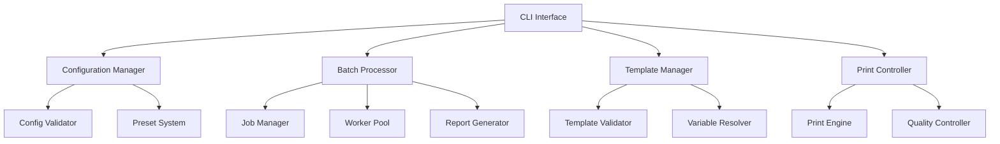

# Enhanced CLI Printing System - Developer Design Document

## Overview

This document outlines the design and implementation requirements for enhancing the Printeer CLI package to support comprehensive printing configurations, batch processing, and professional web-to-print capabilities following industry best practices.

## Table of Contents

- [Current State Analysis](#current-state-analysis)
- [Enhancement Requirements](#enhancement-requirements)
- [Architecture Design](#architecture-design)
- [Configuration System](#configuration-system)
- [Batch Processing System](#batch-processing-system)
- [Template Management](#template-management)
- [CLI Interface Enhancement](#cli-interface-enhancement)
- [Implementation Plan](#implementation-plan)
- [API Specifications](#api-specifications)
- [File Structure](#file-structure)
- [Testing Strategy](#testing-strategy)

## Current State Analysis

### Existing Capabilities
- Basic web-to-PDF/PNG conversion
- Adaptive CLI with interactive and stdio modes
- Simple output format detection
- Basic system diagnostics (doctor command)
- Environment-aware execution

### Limitations Identified
1. **Limited Print Configuration**: Only basic format and output type support
2. **No Batch Processing**: Single URL processing only
3. **Missing Template System**: No header/footer template support
4. **Basic Configuration**: No preset or advanced configuration management
5. **Limited Wait Conditions**: Basic wait strategies only
6. **No Authentication Support**: Missing auth headers and cookies
7. **Limited Quality Controls**: No viewport, scale, or quality options

## Enhancement Requirements

### R1: Comprehensive Print Configuration System
**Priority**: High
**Description**: Implement a comprehensive configuration system supporting all professional printing options.

**Technical Requirements**:
- Support for all standard page formats (A4, A3, Letter, Legal, Custom)
- Margin control (individual sides or unified)
- PDF-specific options (background, headers/footers, tagged PDFs)
- Image-specific options (quality, clipping, encoding)
- Viewport and device emulation
- Media type emulation (screen/print)
- Authentication and custom headers
- Performance optimization controls

### R2: Batch Processing System
**Priority**: High
**Description**: Implement parallel batch processing with job management and reporting.

**Technical Requirements**:
- Support for CSV, JSON, and YAML batch files
- Parallel processing with configurable concurrency
- Job dependency management
- Progress tracking and reporting
- Error handling and retry logic
- Output organization and naming patterns
- Comprehensive batch reports

### R3: Template Management System
**Priority**: Medium
**Description**: Implement a template system for headers, footers, and dynamic content.

**Technical Requirements**:
- Template file support (HTML with variables)
- Built-in template library
- Variable substitution system
- Template validation and preview
- Template sharing and management

### R4: Enhanced CLI Interface
**Priority**: High
**Description**: Extend the CLI with new commands and comprehensive options.

**Technical Requirements**:
- Enhanced convert command with all configuration options
- New batch processing command
- Configuration management commands
- Template management commands
- Interactive configuration wizard
- Backward compatibility with existing CLI

### R5: Configuration File System
**Priority**: Medium
**Description**: Implement a robust configuration file system with validation and presets.

**Technical Requirements**:
- Multiple configuration file formats (JSON, YAML)
- Configuration validation with detailed error messages
- Preset management system
- Configuration inheritance and merging
- Environment-specific configurations

## Architecture Design

### System Components



### Module Responsibilities

#### Configuration Manager (`src/config/enhanced-config.ts`)
- Load and validate configuration files
- Manage configuration presets
- Handle configuration inheritance and merging
- Provide configuration schema validation

#### Batch Processor (`src/batch/batch-processor.ts`)
- Parse batch files (CSV, JSON, YAML)
- Manage job queues and dependencies
- Execute parallel processing
- Generate comprehensive reports

#### Template Manager (`src/templates/template-manager.ts`)
- Load and validate HTML templates
- Handle variable substitution
- Manage built-in and custom templates
- Provide template preview capabilities

#### Print Controller (`src/printing/enhanced-controller.ts`)
- Orchestrate the printing process
- Apply configurations to print engine
- Handle quality control and validation
- Manage output file organization

## Configuration System

### Configuration Schema

```typescript
export interface EnhancedPrintConfiguration {
  // Page Settings
  page: {
    format: PageFormat | { width: string | number; height: string | number };
    orientation: 'portrait' | 'landscape';
    margins: MarginConfig;
  };

  // PDF Specific Options
  pdf: {
    printBackground: boolean;
    displayHeaderFooter: boolean;
    headerTemplate?: string;
    footerTemplate?: string;
    preferCSSPageSize: boolean;
    generateTaggedPDF: boolean;
    scale: number;
    omitBackground: boolean;
    outline: boolean;
    metadata?: PDFMetadata;
  };

  // Image Options
  image: {
    fullPage: boolean;
    clip?: ClipRegion;
    quality: number;
    type: 'png' | 'jpeg' | 'webp';
    encoding: 'base64' | 'binary';
    optimizeForSize: boolean;
  };

  // Viewport Settings
  viewport: {
    width: number;
    height: number;
    deviceScaleFactor: number;
    isMobile: boolean;
    hasTouch: boolean;
    isLandscape: boolean;
  };

  // Wait Conditions
  wait: {
    until: WaitCondition;
    timeout: number;
    selector?: string;
    delay?: number;
    customFunction?: string;
    stabilityCheck?: {
      enabled: boolean;
      threshold: number;
      timeout: number;
    };
  };

  // Authentication & Headers
  auth: {
    basic?: { username: string; password: string };
    headers?: Record<string, string>;
    cookies?: CookieConfig[];
    userAgent?: string;
  };

  // Media & Emulation
  emulation: {
    mediaType: 'screen' | 'print';
    colorScheme: 'light' | 'dark' | 'no-preference';
    reducedMotion: 'reduce' | 'no-preference';
    timezone?: string;
    locale?: string;
    geolocation?: { latitude: number; longitude: number; accuracy: number };
  };

  // Performance & Quality
  performance: {
    blockResources: ResourceType[];
    maxConcurrent: number;
    retryAttempts: number;
    cacheEnabled: boolean;
    javascriptEnabled: boolean;
    loadTimeout: number;
    networkThrottling?: NetworkThrottling;
  };
}
```

### Configuration File Examples

#### Basic Configuration (`printeer.config.json`)
```json
{
  "$schema": "./node_modules/printeer/schemas/config.schema.json",
  "defaults": {
    "page": {
      "format": "A4",
      "orientation": "portrait",
      "margins": "1in"
    },
    "pdf": {
      "printBackground": true,
      "scale": 0.8
    },
    "wait": {
      "until": "networkidle0",
      "timeout": 30000
    }
  },
  "presets": {
    "invoice": {
      "extends": "defaults",
      "page": { "format": "A4" },
      "pdf": {
        "displayHeaderFooter": true,
        "headerTemplate": "invoice-header",
        "footerTemplate": "invoice-footer"
      },
      "emulation": { "mediaType": "print" }
    },
    "screenshot": {
      "extends": "defaults",
      "image": {
        "fullPage": true,
        "quality": 90,
        "type": "png"
      },
      "emulation": { "mediaType": "screen" }
    }
  }
}
```

#### Advanced Configuration with Environment Overrides
```yaml
# printeer.config.yaml
defaults: &defaults
  page:
    format: A4
    orientation: portrait
    margins:
      top: 1in
      right: 0.75in
      bottom: 1in
      left: 0.75in

  pdf:
    printBackground: true
    scale: 0.8
    generateTaggedPDF: false

  wait:
    until: networkidle0
    timeout: 30000
    stabilityCheck:
      enabled: true
      threshold: 500
      timeout: 5000

environments:
  development:
    <<: *defaults
    performance:
      cacheEnabled: false
      javascriptEnabled: true

  production:
    <<: *defaults
    performance:
      cacheEnabled: true
      blockResources: ['font', 'image']
      maxConcurrent: 5
    pdf:
      generateTaggedPDF: true

presets:
  invoice:
    page: { format: A4 }
    pdf:
      displayHeaderFooter: true
      headerTemplate: "{{templates.invoice-header}}"
      footerTemplate: "{{templates.invoice-footer}}"
    emulation: { mediaType: print }

  report:
    page:
      format: A3
      orientation: landscape
    pdf:
      scale: 0.7
      outline: true
```

### Configuration Manager Implementation

```typescript
// src/config/enhanced-config.ts
import { cosmiconfig } from 'cosmiconfig';
import Ajv from 'ajv';
import addFormats from 'ajv-formats';
import { merge } from 'lodash';
import configSchema from '../schemas/config.schema.json';

export class EnhancedConfigurationManager {
  private explorer = cosmiconfig('printeer');
  private validator: Ajv;
  private loadedConfig?: EnhancedPrintConfiguration;

  constructor() {
    this.validator = new Ajv({ allErrors: true });
    addFormats(this.validator);
    this.validator.addSchema(configSchema, 'config');
  }

  async loadConfiguration(
    configPath?: string,
    environment?: string
  ): Promise<EnhancedPrintConfiguration> {
    // Load configuration from file or search
    const result = configPath
      ? await this.explorer.load(configPath)
      : await this.explorer.search();

    if (!result?.config) {
      return this.getDefaultConfiguration();
    }

    // Validate configuration schema
    const isValid = this.validator.validate('config', result.config);
    if (!isValid) {
      throw new ConfigurationError(
        'Invalid configuration',
        this.validator.errors
      );
    }

    // Apply environment-specific overrides
    let config = result.config;
    if (environment && config.environments?.[environment]) {
      config = merge({}, config.defaults, config.environments[environment]);
    } else if (config.defaults) {
      config = config.defaults;
    }

    this.loadedConfig = config;
    return config;
  }

  async getPreset(name: string): Promise<Partial<EnhancedPrintConfiguration>> {
    if (!this.loadedConfig) {
      await this.loadConfiguration();
    }

    const preset = this.loadedConfig?.presets?.[name];
    if (!preset) {
      throw new Error(`Preset '${name}' not found`);
    }

    // Handle preset inheritance
    if (preset.extends) {
      const basePreset = await this.getPreset(preset.extends);
      return merge({}, basePreset, preset);
    }

    return preset;
  }

  validateConfiguration(config: any): ValidationResult {
    const isValid = this.validator.validate('config', config);
    return {
      valid: isValid,
      errors: this.validator.errors || [],
      formattedErrors: this.formatValidationErrors(this.validator.errors)
    };
  }

  private formatValidationErrors(errors?: ErrorObject[]): string[] {
    if (!errors) return [];

    return errors.map(error => {
      const path = error.instancePath || error.schemaPath;
      return `${path}: ${error.message}`;
    });
  }

  getBuiltInPresets(): Record<string, Partial<EnhancedPrintConfiguration>> {
    return {
      'web-article': {
        page: { format: 'A4', orientation: 'portrait' },
        pdf: { printBackground: true, scale: 0.8 },
        wait: { until: 'networkidle0', timeout: 30000 },
        emulation: { mediaType: 'screen' }
      },
      'mobile-responsive': {
        viewport: { width: 375, height: 667, isMobile: true },
        page: { format: 'A4' },
        emulation: { mediaType: 'screen' }
      },
      'print-optimized': {
        emulation: { mediaType: 'print', colorScheme: 'light' },
        pdf: { preferCSSPageSize: true, printBackground: false }
      },
      'high-quality': {
        image: { quality: 100, type: 'png' },
        viewport: { deviceScaleFactor: 2 },
        performance: { blockResources: [] }
      },
      'fast-batch': {
        performance: {
          blockResources: ['image', 'font', 'stylesheet'],
          maxConcurrent: 10,
          cacheEnabled: true
        },
        pdf: { printBackground: false, scale: 0.6 }
      }
    };
  }
}
```

## Batch Processing System

### Batch Job Schema

```typescript
// src/batch/types.ts
export interface BatchJob {
  id: string;
  url: string;
  output: string;
  config?: Partial<EnhancedPrintConfiguration>;
  preset?: string;
  variables?: Record<string, any>;
  metadata?: Record<string, any>;
  priority?: number;
  dependencies?: string[];
  retryCount?: number;
  timeout?: number;
}

export interface BatchOptions {
  concurrency: number;
  retryAttempts: number;
  continueOnError: boolean;
  outputDirectory: string;
  reportFormat: 'json' | 'csv' | 'html';
  progressTracking: boolean;
  dryRun: boolean;
  maxMemoryUsage?: string;
  cleanup: boolean;
}

export interface BatchResult {
  jobId: string;
  status: 'completed' | 'failed' | 'skipped';
  startTime: Date;
  endTime: Date;
  duration: number;
  outputFile?: string;
  error?: string;
  retryCount: number;
  memoryUsed?: number;
  pageMetrics?: {
    loadTime: number;
    resourceCount: number;
    totalSize: number;
  };
}
```

### Batch File Formats

#### CSV Format
```csv
# batch-jobs.csv
id,url,output,preset,variables,priority
invoice-001,https://example.com/invoice/1,invoices/invoice-001.pdf,invoice,"{""invoiceId"":""001""}",1
invoice-002,https://example.com/invoice/2,invoices/invoice-002.pdf,invoice,"{""invoiceId"":""002""}",1
report-monthly,https://example.com/reports/monthly,reports/monthly.pdf,report,"{""month"":""January""}",2
```

#### JSON Format
```json
{
  "metadata": {
    "name": "Monthly Batch Processing",
    "version": "1.0",
    "created": "2025-09-11T10:00:00Z"
  },
  "defaults": {
    "preset": "web-article",
    "outputDirectory": "./output",
    "timeout": 30000
  },
  "jobs": [
    {
      "id": "invoice-batch",
      "url": "https://example.com/invoice/{invoiceId}",
      "output": "invoices/invoice-{invoiceId}.pdf",
      "preset": "invoice",
      "variables": {
        "invoiceIds": ["001", "002", "003", "004"]
      },
      "priority": 1
    },
    {
      "id": "report-generation",
      "url": "https://example.com/reports/{reportType}",
      "output": "reports/{reportType}-report.pdf",
      "config": {
        "page": { "format": "A3", "orientation": "landscape" },
        "pdf": { "scale": 0.7 }
      },
      "variables": {
        "reportTypes": ["sales", "inventory", "financial"]
      },
      "dependencies": ["invoice-batch"],
      "priority": 2
    }
  ]
}
```

#### YAML Format
```yaml
# batch-jobs.yaml
metadata:
  name: "Comprehensive Batch Processing"
  version: "1.0"
  created: "2025-09-11T10:00:00Z"

defaults:
  preset: web-article
  outputDirectory: "./output"
  timeout: 30000

variables:
  baseUrl: "https://example.com"
  outputPath: "./batch-output"

jobs:
  - id: "dynamic-invoice-batch"
    url: "{{baseUrl}}/invoice/{id}"
    output: "{{outputPath}}/invoices/invoice-{id}.pdf"
    preset: "invoice"
    variables:
      ids: [1, 2, 3, 4, 5]
    priority: 1

  - id: "screenshot-batch"
    url: "{{baseUrl}}/products/{productId}"
    output: "{{outputPath}}/screenshots/product-{productId}.png"
    preset: "screenshot"
    variables:
      productIds: ["prod-001", "prod-002", "prod-003"]
    config:
      image:
        quality: 95
        fullPage: false
        clip:
          x: 0
          y: 0
          width: 1200
          height: 800
    dependencies: ["dynamic-invoice-batch"]
```

### Batch Processor Implementation - Integrated with Browser Pool Optimization

```typescript
// src/batch/batch-processor.ts
import { EventEmitter } from 'events';
import { DefaultResourceManager } from '../resources/resource-manager';
import { DefaultBrowserManager } from '../printing/browser';
import { DefaultConverter } from '../printing/converter';
import { DefaultCleanupManager } from '../resources/cleanup-manager';
import { DefaultBrowserPoolOptimizer } from '../resources/browser-pool-optimizer';
import { EnhancedConfigurationManager } from '../config/enhanced-config';

export class BatchProcessor extends EventEmitter {
  private resourceManager: DefaultResourceManager;
  private browserManager: DefaultBrowserManager;
  private browserPoolOptimizer: DefaultBrowserPoolOptimizer;
  private converter: DefaultConverter;
  private cleanupManager: DefaultCleanupManager;
  private configManager: EnhancedConfigurationManager;
  private results: Map<string, BatchResult> = new Map();
  private startTime?: Date;
  private activeJobs = 0;
  private maxConcurrency: number;

  constructor(options: BatchOptions) {
    super();
    this.maxConcurrency = options.concurrency;

    // Initialize with existing optimized components
    this.resourceManager = new DefaultResourceManager({
      memoryWarning: 0.7,
      memoryCritical: 0.9,
      cpuWarning: 0.8,
      cpuCritical: 0.95,
      diskWarning: 0.85,
      diskCritical: 0.95
    });

    // Use intelligent browser pool sizing
    this.browserPoolOptimizer = new DefaultBrowserPoolOptimizer();

    this.browserManager = new DefaultBrowserManager(undefined, {
      minSize: 1,
      maxSize: Math.min(options.concurrency, 8), // Respect concurrency limits
      idleTimeout: 30000,
      cleanupInterval: 60000
    });

    this.converter = new DefaultConverter();
    this.cleanupManager = new DefaultCleanupManager();
    this.configManager = new EnhancedConfigurationManager();

    // Set up intelligent resource monitoring
    this.setupResourceOptimization();
  }

  async processBatchFile(
    batchFile: string,
    options: BatchOptions
  ): Promise<BatchReport> {
    try {
      // Initialize systems with resource optimization
      await this.initialize();

      // Load and validate batch file
      const batchData = await this.loadBatchFile(batchFile);
      const validation = await this.validateBatchData(batchData);

      if (!validation.valid) {
        throw new BatchValidationError(
          'Invalid batch file',
          validation.errors
        );
      }

      // Process the batch with intelligent resource management
      return await this.processBatch(batchData.jobs, options);
    } catch (error) {
      this.emit('error', error);
      throw error;
    } finally {
      await this.cleanup();
    }
  }

  async processBatch(
    jobs: BatchJob[],
    options: BatchOptions
  ): Promise<BatchReport> {
    this.startTime = new Date();

    try {
      // Validate and prepare jobs
      const processedJobs = await this.prepareJobs(jobs, options);

      // Execute dry run if requested
      if (options.dryRun) {
        return this.generateDryRunReport(processedJobs, options);
      }

      // Process jobs with intelligent resource optimization and browser pool management
      await this.processJobsWithResourceOptimization(processedJobs, options);

      // Generate final report with resource metrics
      return await this.generateBatchReport(options);
    } finally {
      await this.cleanup();
    }
  }

  private async initialize(): Promise<void> {
    // Start resource monitoring for intelligent optimization
    this.resourceManager.startMonitoring();

    // Initialize browser pool with optimal sizing
    await this.browserManager.initialize();

    // Set up resource pressure response system
    this.resourceManager.onResourcePressure(async (pressure) => {
      await this.handleResourcePressure(pressure);
    });

    console.info('Batch processor initialized with browser pool optimization');
  }

  private setupResourceOptimization(): void {
    // Dynamic concurrency adjustment based on resource availability
    this.resourceManager.onResourcePressure(async (pressure) => {
      if (pressure.memory || pressure.cpu) {
        // Intelligently reduce concurrency under pressure
        const currentMetrics = await this.resourceManager.getLatestMetrics();
        const optimalPoolSize = this.browserPoolOptimizer.calculateOptimalPoolSize(currentMetrics);

        this.maxConcurrency = Math.max(1, Math.min(this.maxConcurrency, optimalPoolSize));

        this.emit('concurrency-adjusted', {
          reason: 'resource-pressure',
          newLimit: this.maxConcurrency,
          resourcePressure: pressure
        });
      }
    });
  }

  private async processJobsWithResourceOptimization(
    jobs: BatchJob[],
    options: BatchOptions
  ): Promise<void> {
    // Build dependency graph for intelligent job scheduling
    const dependencyGraph = this.buildDependencyGraph(jobs);

    // Process jobs with dynamic resource-aware concurrency
    const processedJobs = new Set<string>();
    const processingJobs = new Set<string>();
    const jobQueue: BatchJob[] = [];

    // Initialize queue with jobs that have no dependencies
    jobs.forEach(job => {
      if (!job.dependencies || job.dependencies.length === 0) {
        jobQueue.push(job);
      }
    });

    while (jobQueue.length > 0 || processingJobs.size > 0) {
      // Get current resource metrics for optimization decisions
      const metrics = await this.resourceManager.getLatestMetrics();

      // Calculate optimal concurrency based on resource availability
      const optimalConcurrency = this.browserPoolOptimizer.calculateOptimalPoolSize(metrics);
      const actualConcurrency = Math.min(
        this.maxConcurrency,
        Math.min(optimalConcurrency, options.concurrency),
        this.activeJobs + Math.max(1, jobQueue.length)
      );

      // Process jobs while respecting intelligent resource limits
      while (this.activeJobs < actualConcurrency && jobQueue.length > 0) {
        const job = jobQueue.shift()!;

        if (!processedJobs.has(job.id) && !processingJobs.has(job.id)) {
          processingJobs.add(job.id);
          // Process job asynchronously with resource monitoring
          this.processJobWithBrowserPool(job, options, processedJobs, processingJobs, jobQueue, jobs)
            .catch(error => {
              this.emit('job-failed', job, error);
              if (!options.continueOnError) {
                throw error;
              }
            });
        }
      }

      // Brief pause to allow resource metrics to update
      if (jobQueue.length > 0 || processingJobs.size > 0) {
        await new Promise(resolve => setTimeout(resolve, 50));
      }
    }
  }

  private async processJobWithBrowserPool(
    job: BatchJob,
    options: BatchOptions,
    processedJobs: Set<string>,
    processingJobs: Set<string>,
    jobQueue: BatchJob[],
    allJobs: BatchJob[]
  ): Promise<void> {
    this.activeJobs++;
    this.resourceManager.incrementActiveRequests();
    this.resourceManager.incrementBrowserInstances(); // Track resource usage

    try {
      const result = await this.executeJobWithOptimizedBrowser(job, options);
      this.results.set(job.id, result);
      this.emit('job-completed', job, result);

      // Queue dependent jobs when this job completes
      allJobs.forEach(candidateJob => {
        if (candidateJob.dependencies?.includes(job.id) &&
            !processedJobs.has(candidateJob.id) &&
            !processingJobs.has(candidateJob.id)) {

          // Check if all dependencies are satisfied
          const allDepsCompleted = candidateJob.dependencies.every(depId =>
            processedJobs.has(depId)
          );

          if (allDepsCompleted) {
            jobQueue.push(candidateJob);
          }
        }
      });

    } catch (error) {
      const failureResult: BatchResult = {
        jobId: job.id,
        status: 'failed',
        startTime: new Date(),
        endTime: new Date(),
        duration: 0,
        error: error.message,
        retryCount: job.retryCount || 0
      };

      this.results.set(job.id, failureResult);
      this.emit('job-failed', job, error);

      if (!options.continueOnError) {
        throw error;
      }
    } finally {
      this.activeJobs--;
      this.resourceManager.decrementActiveRequests();
      this.resourceManager.decrementBrowserInstances();
      processingJobs.delete(job.id);
      processedJobs.add(job.id);
    }
  }

  private async executeJobWithOptimizedBrowser(
    job: BatchJob,
    options: BatchOptions
  ): Promise<BatchResult> {
    const startTime = new Date();

    try {
      // Get browser instance from optimized pool
      const browserInstance = await this.browserManager.getBrowser();

      try {
        // Apply job configuration with intelligent defaults
        const config = await this.resolveJobConfiguration(job);

        // Execute conversion with resource monitoring
        const convertOptions = {
          url: job.url,
          output: job.output,
          browserInstance, // Pass the optimized browser instance
          ...config
        };

        const conversionResult = await this.converter.convert(convertOptions);

        const endTime = new Date();
        const result: BatchResult = {
          jobId: job.id,
          status: 'completed',
          startTime,
          endTime,
          duration: endTime.getTime() - startTime.getTime(),
          outputFile: conversionResult.outputPath,
          retryCount: job.retryCount || 0,
          memoryUsed: conversionResult.metrics?.memoryUsed,
          pageMetrics: {
            loadTime: conversionResult.metrics?.loadTime || 0,
            resourceCount: conversionResult.metrics?.resourceCount || 0,
            totalSize: conversionResult.metrics?.totalSize || 0
          }
        };

        return result;

      } finally {
        // Always release browser back to optimized pool
        await this.browserManager.releaseBrowser(browserInstance);
      }

    } catch (error) {
      throw new Error(`Job execution failed: ${error.message}`);
    }
  }

  private async handleResourcePressure(pressure: ResourcePressure): Promise<void> {
    if (pressure.memory) {
      // Immediate memory optimization using existing cleanup manager
      await this.cleanupManager.cleanupMemory();
      this.emit('resource-pressure', { type: 'memory', action: 'cleanup-performed' });
    }

    if (pressure.disk) {
      // Immediate disk cleanup using existing cleanup manager
      await this.cleanupManager.cleanupTempFiles();
      this.emit('resource-pressure', { type: 'disk', action: 'temp-files-cleaned' });
    }

    if (pressure.cpu) {
      // Reduce concurrency intelligently
      const currentMetrics = await this.resourceManager.getLatestMetrics();
      const shouldShrink = this.browserPoolOptimizer.shouldShrinkPool(currentMetrics);

      if (shouldShrink) {
        this.maxConcurrency = Math.max(1, Math.ceil(this.maxConcurrency * 0.7));
        this.emit('resource-pressure', { type: 'cpu', action: 'concurrency-reduced' });
      }
    }
  }

  private async cleanup(): Promise<void> {
    // Stop resource monitoring
    this.resourceManager.stopMonitoring();

    // Shutdown browser pool gracefully using existing manager
    await this.browserManager.shutdown();

    // Final cleanup using existing cleanup manager
    await this.cleanupManager.cleanupTempFiles();
    await this.cleanupManager.cleanupBrowserResources();

    // Reset state
    this.results.clear();
    this.activeJobs = 0;

    console.info('Batch processor cleanup completed with resource optimization');
  }

  // Helper methods for integration with existing systems
  private async resolveJobConfiguration(job: BatchJob): Promise<EnhancedPrintConfiguration> {
    // Load base configuration
    let config = await this.configManager.loadConfiguration();

    // Apply preset if specified - leveraging existing preset system
    if (job.preset) {
      const preset = await this.configManager.getPreset(job.preset);
      config = merge(config, preset);
    }

    // Apply job-specific configuration
    if (job.config) {
      config = merge(config, job.config);
    }

    // Apply intelligent resource-based optimizations
    const currentMetrics = await this.resourceManager.getLatestMetrics();
    config = this.applyResourceOptimizations(config, currentMetrics);

    return config;
  }

  private applyResourceOptimizations(
    config: EnhancedPrintConfiguration,
    metrics: ResourceMetrics
  ): EnhancedPrintConfiguration {
    const optimizedConfig = { ...config };

    // Apply memory-based optimizations
    if (metrics.memoryUsage > 0.8) {
      // Reduce quality and disable resource-intensive features under memory pressure
      if (optimizedConfig.image) {
        optimizedConfig.image.quality = Math.min(optimizedConfig.image.quality || 90, 70);
      }
      if (optimizedConfig.performance) {
        optimizedConfig.performance.blockResources = [
          ...(optimizedConfig.performance.blockResources || []),
          'image', 'font'
        ];
      }
    }

    // Apply CPU-based optimizations
    if (metrics.cpuUsage > 0.8) {
      // Disable JavaScript and reduce concurrent operations under CPU pressure
      if (optimizedConfig.performance) {
        optimizedConfig.performance.javascriptEnabled = false;
        optimizedConfig.performance.maxConcurrent = 1;
      }
    }

    // Apply disk-based optimizations
    if (metrics.diskUsage > 0.9) {
      // Use more aggressive compression and smaller outputs under disk pressure
      if (optimizedConfig.pdf) {
        optimizedConfig.pdf.scale = Math.min(optimizedConfig.pdf.scale || 1.0, 0.8);
      }
      if (optimizedConfig.image) {
        optimizedConfig.image.optimizeForSize = true;
        optimizedConfig.image.quality = Math.min(optimizedConfig.image.quality || 90, 60);
      }
    }

    return optimizedConfig;
  }

  private buildDependencyGraph(jobs: BatchJob[]): Map<string, string[]> {
    const graph = new Map<string, string[]>();

    for (const job of jobs) {
      graph.set(job.id, job.dependencies || []);
    }

    return graph;
  }

  private async generateBatchReport(options: BatchOptions): Promise<BatchReport> {
    const results = Array.from(this.results.values());
    const totalJobs = results.length;
    const successfulJobs = results.filter(r => r.status === 'completed').length;
    const failedJobs = results.filter(r => r.status === 'failed').length;
    const skippedJobs = results.filter(r => r.status === 'skipped').length;

    const totalDuration = this.startTime
      ? new Date().getTime() - this.startTime.getTime()
      : 0;

    // Include resource metrics and browser pool status for optimization insights
    const resourceMetrics = this.resourceManager.getMetricsHistory();
    const browserPoolStatus = this.browserManager.getPoolStatus();

    const report: BatchReport = {
      totalJobs,
      successfulJobs,
      failedJobs,
      skippedJobs,
      totalDuration,
      startTime: this.startTime || new Date(),
      endTime: new Date(),
      results,
      resourceMetrics, // Include resource usage history
      browserPoolMetrics: browserPoolStatus, // Include browser pool performance
      optimizationInsights: {
        averageMemoryUsage: resourceMetrics.reduce((sum, m) => sum + m.memoryUsage, 0) / resourceMetrics.length,
        peakMemoryUsage: Math.max(...resourceMetrics.map(m => m.memoryUsage)),
        averageCpuUsage: resourceMetrics.reduce((sum, m) => sum + m.cpuUsage, 0) / resourceMetrics.length,
        peakCpuUsage: Math.max(...resourceMetrics.map(m => m.cpuUsage)),
        browserInstancesCreated: browserPoolStatus.metrics.created,
        browserInstancesReused: browserPoolStatus.metrics.reused,
        totalBrowserErrors: browserPoolStatus.metrics.errors
      }
    };

    return report;
  }

  // Additional utility methods for integration
  private async loadBatchFile(filePath: string): Promise<BatchData> {
    const ext = path.extname(filePath).toLowerCase();
    const content = await fs.readFile(filePath, 'utf-8');

    switch (ext) {
      case '.csv':
        return this.parseCSVBatch(content);
      case '.json':
        return JSON.parse(content);
      case '.yaml':
      case '.yml':
        return yaml.parse(content);
      default:
        throw new Error(`Unsupported batch file format: ${ext}`);
    }
  }

  private async validateBatchData(batchData: BatchData): Promise<ValidationResult> {
    // Implement batch data validation logic
    const errors: string[] = [];

    if (!batchData.jobs || batchData.jobs.length === 0) {
      errors.push('Batch file must contain at least one job');
    }

    return { valid: errors.length === 0, errors, formattedErrors: errors };
  }

  private async prepareJobs(jobs: BatchJob[], options: BatchOptions): Promise<BatchJob[]> {
    const preparedJobs: BatchJob[] = [];

    for (const job of jobs) {
      // Expand jobs with variables (e.g., array variables create multiple jobs)
      const expandedJobs = await this.expandJobVariables(job);

      // Validate each expanded job
      for (const expandedJob of expandedJobs) {
        preparedJobs.push(expandedJob);
      }
    }

    return preparedJobs;
  }

  private async expandJobVariables(job: BatchJob): Promise<BatchJob[]> {
    if (!job.variables) {
      return [job];
    }

    // Implementation for expanding variable-based jobs
    return [job]; // Simplified for now
  }
}

  private async prepareJobs(
    jobs: BatchJob[],
    options: BatchOptions
  ): Promise<BatchJob[]> {
    const preparedJobs: BatchJob[] = [];

    for (const job of jobs) {
      // Expand jobs with variables (e.g., array variables create multiple jobs)
      const expandedJobs = await this.expandJobVariables(job);

      // Validate each job
      for (const expandedJob of expandedJobs) {
        const validation = await this.validator.validateJob(expandedJob);
        if (!validation.valid) {
          if (options.continueOnError) {
            this.emit('job-validation-error', expandedJob, validation.errors);
            continue;
          } else {
            throw new JobValidationError(
              `Invalid job: ${expandedJob.id}`,
              validation.errors
            );
          }
        }
        preparedJobs.push(expandedJob);
      }
    }

    return preparedJobs;
  }

  private async processJobsWithDependencies(
    jobs: BatchJob[],
    options: BatchOptions
  ): Promise<void> {
    // Build dependency graph
    const dependencyGraph = this.buildDependencyGraph(jobs);

    // Process jobs in dependency order
    const processedJobs = new Set<string>();
    const processingJobs = new Set<string>();

    const processJob = async (job: BatchJob): Promise<void> => {
      if (processedJobs.has(job.id) || processingJobs.has(job.id)) {
        return;
      }

      // Wait for dependencies
      if (job.dependencies) {
        for (const depId of job.dependencies) {
          const depJob = jobs.find(j => j.id === depId);
          if (depJob) {
            await processJob(depJob);
          }
        }
      }

      processingJobs.add(job.id);

      try {
        const result = await this.workerPool.execute(job, options);
        this.results.set(job.id, result);
        this.emit('job-completed', job, result);
      } catch (error) {
        const failureResult: BatchResult = {
          jobId: job.id,
          status: 'failed',
          startTime: new Date(),
          endTime: new Date(),
          duration: 0,
          error: error.message,
          retryCount: job.retryCount || 0
        };

        this.results.set(job.id, failureResult);
        this.emit('job-failed', job, error);

        if (!options.continueOnError) {
          throw error;
        }
      } finally {
        processingJobs.delete(job.id);
        processedJobs.add(job.id);
      }
    };

    // Process all jobs
    const promises = jobs.map(job => processJob(job));
    await Promise.all(promises);
  }

  private async expandJobVariables(job: BatchJob): Promise<BatchJob[]> {
    if (!job.variables) {
      return [job];
    }

    const expandedJobs: BatchJob[] = [];
    const variableKeys = Object.keys(job.variables);

    // Find array variables for expansion
    const arrayVariables = variableKeys.filter(key =>
      Array.isArray(job.variables![key])
    );

    if (arrayVariables.length === 0) {
      // No array variables, just substitute scalar variables
      return [this.substituteVariables(job, job.variables)];
    }

    // Expand array variables
    const arrayVar = arrayVariables[0]; // Handle first array variable
    const arrayValues = job.variables[arrayVar] as any[];

    for (const value of arrayValues) {
      const variableSet = { ...job.variables, [arrayVar]: value };
      const expandedJob = this.substituteVariables(job, variableSet);
      expandedJob.id = `${job.id}-${value}`;
      expandedJobs.push(expandedJob);
    }

    return expandedJobs;
  }

  private substituteVariables(
    job: BatchJob,
    variables: Record<string, any>
  ): BatchJob {
    const substituted = { ...job };

    // Substitute in URL
    substituted.url = this.substituteString(job.url, variables);

    // Substitute in output path
    substituted.output = this.substituteString(job.output, variables);

    return substituted;
  }

  private substituteString(template: string, variables: Record<string, any>): string {
    return template.replace(/\{(\w+)\}/g, (match, key) => {
      return variables[key]?.toString() || match;
    });
  }

  private buildDependencyGraph(jobs: BatchJob[]): Map<string, string[]> {
    const graph = new Map<string, string[]>();

    for (const job of jobs) {
      graph.set(job.id, job.dependencies || []);
    }

    return graph;
  }

  private async loadBatchFile(filePath: string): Promise<BatchData> {
    const ext = path.extname(filePath).toLowerCase();
    const content = await fs.readFile(filePath, 'utf-8');

    switch (ext) {
      case '.csv':
        return this.parseCSVBatch(content);
      case '.json':
        return JSON.parse(content);
      case '.yaml':
      case '.yml':
        return yaml.parse(content);
      default:
        throw new Error(`Unsupported batch file format: ${ext}`);
    }
  }

  private parseCSVBatch(content: string): BatchData {
    const lines = content.split('\n').filter(line =>
      line.trim() && !line.startsWith('#')
    );

    const headers = lines[0].split(',').map(h => h.trim());
    const jobs: BatchJob[] = [];

    for (let i = 1; i < lines.length; i++) {
      const values = lines[i].split(',').map(v => v.trim());
      const job: BatchJob = {
        id: values[headers.indexOf('id')] || `job-${i}`,
        url: values[headers.indexOf('url')],
        output: values[headers.indexOf('output')],
      };

      // Parse optional fields
      const presetIndex = headers.indexOf('preset');
      if (presetIndex >= 0 && values[presetIndex]) {
        job.preset = values[presetIndex];
      }

      const variablesIndex = headers.indexOf('variables');
      if (variablesIndex >= 0 && values[variablesIndex]) {
        try {
          job.variables = JSON.parse(values[variablesIndex]);
        } catch (e) {
          // Ignore JSON parsing errors for CSV
        }
      }

      const priorityIndex = headers.indexOf('priority');
      if (priorityIndex >= 0 && values[priorityIndex]) {
        job.priority = parseInt(values[priorityIndex], 10);
      }

      jobs.push(job);
    }

    return { jobs, metadata: {} };
  }
}
```

## Template Management

### Template System Design

```typescript
// src/templates/template-manager.ts
export class TemplateManager {
  private templates: Map<string, Template> = new Map();
  private builtInTemplates: Map<string, string> = new Map();

  constructor() {
    this.loadBuiltInTemplates();
  }

  async loadTemplate(name: string, filePath: string): Promise<void> {
    try {
      const content = await fs.readFile(filePath, 'utf-8');
      const template = await this.parseTemplate(content, name);

      // Validate template
      const validation = await this.validateTemplate(template);
      if (!validation.valid) {
        throw new TemplateValidationError(
          `Invalid template: ${name}`,
          validation.errors
        );
      }

      this.templates.set(name, template);
    } catch (error) {
      throw new TemplateLoadError(`Failed to load template: ${name}`, error);
    }
  }

  renderTemplate(
    name: string,
    variables: Record<string, any>
  ): string {
    const template = this.templates.get(name) ||
                    this.getBuiltInTemplate(name);

    if (!template) {
      throw new Error(`Template '${name}' not found`);
    }

    return this.renderTemplateContent(template.content, variables);
  }

  private renderTemplateContent(
    content: string,
    variables: Record<string, any>
  ): string {
    // Handle different variable syntaxes
    let rendered = content;

    // Handle {{variable}} syntax
    rendered = rendered.replace(/\{\{(\w+(?:\.\w+)*)\}\}/g, (match, path) => {
      const value = this.getNestedValue(variables, path);
      return value !== undefined ? String(value) : match;
    });

    // Handle {variable} syntax
    rendered = rendered.replace(/\{(\w+)\}/g, (match, key) => {
      return variables[key] !== undefined ? String(variables[key]) : match;
    });

    // Handle special Puppeteer variables
    rendered = this.handleSpecialVariables(rendered);

    return rendered;
  }

  private handleSpecialVariables(content: string): string {
    // Replace Puppeteer-specific variables
    return content
      .replace(/\{\{pageNumber\}\}/g, '<span class="pageNumber"></span>')
      .replace(/\{\{totalPages\}\}/g, '<span class="totalPages"></span>')
      .replace(/\{\{date\}\}/g, new Date().toLocaleDateString())
      .replace(/\{\{time\}\}/g, new Date().toLocaleTimeString())
      .replace(/\{\{url\}\}/g, '<span class="url"></span>')
      .replace(/\{\{title\}\}/g, '<span class="title"></span>');
  }

  private getNestedValue(obj: any, path: string): any {
    return path.split('.').reduce((current, key) => {
      return current && current[key] !== undefined ? current[key] : undefined;
    }, obj);
  }

  async validateTemplate(template: Template): Promise<ValidationResult> {
    const errors: string[] = [];

    // Validate HTML structure
    try {
      // Basic HTML validation (you might want to use a proper HTML parser)
      if (!template.content.trim()) {
        errors.push('Template content cannot be empty');
      }

      // Check for required CSS classes for page variables
      if (template.type === 'header' || template.type === 'footer') {
        if (template.content.includes('pageNumber') &&
            !template.content.includes('class="pageNumber"')) {
          errors.push('pageNumber variable must use class="pageNumber"');
        }

        if (template.content.includes('totalPages') &&
            !template.content.includes('class="totalPages"')) {
          errors.push('totalPages variable must use class="totalPages"');
        }
      }

      // Validate variable syntax
      const invalidVariables = template.content.match(/\{\{[^}]*\}\}/g)?.filter(v =>
        !/^\{\{\w+(?:\.\w+)*\}\}$/.test(v)
      );

      if (invalidVariables && invalidVariables.length > 0) {
        errors.push(`Invalid variable syntax: ${invalidVariables.join(', ')}`);
      }

    } catch (error) {
      errors.push(`Template parsing error: ${error.message}`);
    }

    return {
      valid: errors.length === 0,
      errors,
      formattedErrors: errors
    };
  }

  getBuiltInTemplates(): Record<string, string> {
    return {
      'simple-header': `
        <div style="font-size: 10px; text-align: center; width: 100%; padding: 5px 0;">
          <span style="float: left;">{{title}}</span>
          <span style="float: right;">Page <span class="pageNumber"></span> of <span class="totalPages"></span></span>
        </div>
      `,
      'simple-footer': `
        <div style="font-size: 9px; text-align: center; width: 100%; padding: 5px 0;">
          <span>Generated on {{date}} at {{time}}</span>
        </div>
      `,
      'company-header': `
        <div style="font-size: 11px; width: 100%; padding: 10px 0; border-bottom: 1px solid #ccc;">
          <div style="float: left;">
            <strong>{{company.name}}</strong><br>
            <small>{{company.address}}</small>
          </div>
          <div style="float: right; text-align: right;">
            <strong>{{document.type}}</strong><br>
            <small>{{document.date}}</small>
          </div>
        </div>
      `,
      'company-footer': `
        <div style="font-size: 9px; text-align: center; width: 100%; padding: 5px 0; border-top: 1px solid #ccc;">
          <span>{{company.name}} - {{company.website}} - Page <span class="pageNumber"></span> of <span class="totalPages"></span></span>
        </div>
      `,
      'invoice-header': `
        <div style="font-size: 12px; width: 100%; padding: 15px 0;">
          <table style="width: 100%; border-collapse: collapse;">
            <tr>
              <td style="width: 50%; vertical-align: top;">
                <strong style="font-size: 14px;">{{company.name}}</strong><br>
                {{company.address}}<br>
                {{company.city}}, {{company.state}} {{company.zip}}<br>
                {{company.phone}}
              </td>
              <td style="width: 50%; text-align: right; vertical-align: top;">
                <h2 style="margin: 0; color: #333;">INVOICE</h2>
                <strong>Invoice #: {{invoice.number}}</strong><br>
                <strong>Date: {{invoice.date}}</strong><br>
                <strong>Due Date: {{invoice.dueDate}}</strong>
              </td>
            </tr>
          </table>
        </div>
      `,
      'report-header': `
        <div style="font-size: 11px; width: 100%; padding: 10px 0; background: #f5f5f5;">
          <table style="width: 100%; border-collapse: collapse;">
            <tr>
              <td style="width: 33%; vertical-align: middle;">
                <strong>{{report.title}}</strong>
              </td>
              <td style="width: 34%; text-align: center; vertical-align: middle;">
                Period: {{report.period}}
              </td>
              <td style="width: 33%; text-align: right; vertical-align: middle;">
                Page <span class="pageNumber"></span> of <span class="totalPages"></span>
              </td>
            </tr>
          </table>
        </div>
      `
    };
  }

  private loadBuiltInTemplates(): void {
    const templates = this.getBuiltInTemplates();
    for (const [name, content] of Object.entries(templates)) {
      this.builtInTemplates.set(name, content);
    }
  }

  private getBuiltInTemplate(name: string): Template | null {
    const content = this.builtInTemplates.get(name);
    if (!content) {
      return null;
    }

    return {
      name,
      content,
      type: name.includes('header') ? 'header' : 'footer',
      variables: this.extractVariables(content)
    };
  }

  private async parseTemplate(content: string, name: string): Promise<Template> {
    const variables = this.extractVariables(content);
    const type = this.detectTemplateType(content, name);

    return {
      name,
      content,
      type,
      variables
    };
  }

  private extractVariables(content: string): string[] {
    const variables = new Set<string>();

    // Extract {{variable}} patterns
    const matches = content.match(/\{\{(\w+(?:\.\w+)*)\}\}/g);
    if (matches) {
      matches.forEach(match => {
        const variable = match.slice(2, -2); // Remove {{ and }}
        variables.add(variable);
      });
    }

    return Array.from(variables);
  }

  private detectTemplateType(content: string, name: string): TemplateType {
    if (name.toLowerCase().includes('header') ||
        content.includes('pageNumber') ||
        content.includes('totalPages')) {
      return 'header';
    }

    if (name.toLowerCase().includes('footer')) {
      return 'footer';
    }

    return 'content';
  }
}

interface Template {
  name: string;
  content: string;
  type: TemplateType;
  variables: string[];
}

type TemplateType = 'header' | 'footer' | 'content';
```

## CLI Interface Enhancement

### Enhanced CLI Commands

```typescript
// src/cli/enhanced-cli.ts
import { Command } from 'commander';
import { EnhancedConfigurationManager } from '../config/enhanced-config';
import { BatchProcessor } from '../batch/batch-processor';
import { TemplateManager } from '../templates/template-manager';
import { EnhancedPrintController } from '../printing/enhanced-controller';

const program = new Command();

// Utility function to collect multiple option values
function collect(value: string, previous: string[] = []): string[] {
  return previous.concat([value]);
}

// Enhanced convert command with flexible URL-output pairing
program
  .command('convert')
  .alias('c')
  .description('Convert web page(s) to PDF/PNG with flexible URL-output pairing')
  .option('-u, --url <url>', 'URL to convert (can be used multiple times)', collect, [])
  .option('-o, --output <filename>', 'Output filename for preceding --url (optional)', collect, [])
  .option('--output-dir <dir>', 'Output directory for generated filenames')
  .option('--output-pattern <pattern>', 'Filename pattern for auto-generated names (e.g., "{title}.pdf", "{domain}_{timestamp}.png")')
  .option('--output-conflict <strategy>', 'Conflict resolution: "override", "copy", "skip", "prompt"', 'copy')
  .option('--title-fallback', 'Use webpage title for filename when --output not specified (default behavior)')
  .option('--url-fallback', 'Use URL-based algorithm when title unavailable')
  .option('-c, --config <path>', 'Configuration file path')
  .option('-p, --preset <name>', 'Use configuration preset')
  .option('-e, --env <environment>', 'Environment (development, production)')

  // Page options
  .option('-f, --format <format>', 'Page format (A4, A3, Letter, Legal, custom)')
  .option('--orientation <type>', 'Page orientation (portrait/landscape)')
  .option('--margins <margins>', 'Page margins (e.g., "1in" or "top:1in,right:0.5in")')
  .option('--custom-size <size>', 'Custom page size (e.g., "210mm,297mm")')

  // Viewport options
  .option('--viewport <size>', 'Viewport size (e.g., "1920x1080")')
  .option('--device-scale <factor>', 'Device scale factor (0.1-3.0)', parseFloat)
  .option('--mobile', 'Emulate mobile device')
  .option('--landscape-viewport', 'Use landscape viewport')

  // Wait conditions
  .option('--wait-until <condition>', 'Wait condition (load, domcontentloaded, networkidle0, networkidle2)')
  .option('--wait-timeout <ms>', 'Wait timeout in milliseconds', parseInt)
  .option('--wait-selector <selector>', 'Wait for CSS selector to appear')
  .option('--wait-delay <ms>', 'Additional delay in milliseconds', parseInt)
  .option('--wait-function <js>', 'Custom JavaScript function to wait for')

  // Media and emulation
  .option('--media-type <type>', 'Emulate media type (screen/print)')
  .option('--color-scheme <scheme>', 'Color scheme (light/dark/no-preference)')
  .option('--timezone <tz>', 'Timezone (e.g., "America/New_York")')
  .option('--locale <locale>', 'Locale (e.g., "en-US")')
  .option('--user-agent <ua>', 'Custom user agent string')

  // PDF specific options
  .option('--scale <factor>', 'Scale factor (0.1-2.0)', parseFloat)
  .option('--print-background', 'Print background graphics')
  .option('--no-print-background', 'Don\'t print background graphics')
  .option('--header-template <template>', 'Header template name or file path')
  .option('--footer-template <template>', 'Footer template name or file path')
  .option('--header-footer', 'Display header and footer')
  .option('--prefer-css-page-size', 'Prefer CSS page size')
  .option('--tagged-pdf', 'Generate tagged PDF (accessibility)')
  .option('--pdf-outline', 'Generate PDF outline/bookmarks')

  // Image specific options
  .option('--quality <number>', 'Image quality (1-100, JPEG/WebP only)', parseInt)
  .option('--image-type <type>', 'Image type (png/jpeg/webp)')
  .option('--full-page', 'Capture full page')
  .option('--clip <region>', 'Clip region (x,y,width,height)')
  .option('--optimize-size', 'Optimize image file size')

  // Authentication
  .option('--auth <credentials>', 'Basic auth (username:password)')
  .option('--headers <json>', 'Custom headers (JSON string)')
  .option('--cookies <json>', 'Custom cookies (JSON string)')

  // Performance
  .option('--block-resources <types>', 'Block resource types (image,stylesheet,font,script)')
  .option('--disable-javascript', 'Disable JavaScript execution')
  .option('--cache', 'Enable caching')
  .option('--no-cache', 'Disable caching')
  .option('--load-timeout <ms>', 'Page load timeout', parseInt)
  .option('--retry <attempts>', 'Retry attempts on failure', parseInt)

  // Output options
  .option('-q, --quiet', 'Suppress output')
  .option('--verbose', 'Verbose output')
  .option('--dry-run', 'Validate configuration without converting')
  .option('--output-metadata', 'Include metadata in output')

  .action(async (options) => {
    try {
      // Validate URL-output pairing
      if (!options.url || options.url.length === 0) {
        throw new Error('At least one --url must be specified');
      }

      // Ensure output array doesn't exceed url array
      if (options.output && options.output.length > options.url.length) {
        throw new Error('Number of --output options cannot exceed number of --url options');
      }

      await runEnhancedConvertWithPairing(options);
    } catch (error) {
      console.error('Conversion failed:', error.message);
      process.exit(1);
    }
  });

// Batch processing command
program
  .command('batch')
  .alias('b')
  .description('Process multiple URLs from batch file')
  .argument('<batchFile>', 'Batch file (CSV, JSON, or YAML)')
  .option('-o, --output-dir <dir>', 'Output directory', './output')
  .option('-c, --concurrency <num>', 'Concurrent processes', '3')
  .option('--max-memory <amount>', 'Maximum memory usage (e.g., "2GB")')
  .option('--continue-on-error', 'Continue processing on individual failures')
  .option('--report <format>', 'Report format (json, csv, html)', 'json')
  .option('--report-file <path>', 'Report output file')
  .option('--retry <attempts>', 'Retry attempts for failed jobs', '2')
  .option('--progress', 'Show progress bar')
  .option('--dry-run', 'Validate batch file without processing')
  .option('--cleanup', 'Cleanup temporary files after processing')
  .option('-q, --quiet', 'Suppress output except errors')
  .option('--verbose', 'Verbose output')
  .action(async (batchFile, options) => {
    try {
      await runBatchProcess(batchFile, options);
    } catch (error) {
      console.error('Batch processing failed:', error.message);
      process.exit(1);
    }
  });

// Configuration management commands
const configCmd = program
  .command('config')
  .description('Configuration management');

configCmd
  .command('init')
  .description('Initialize configuration file')
  .option('-t, --template <name>', 'Configuration template (basic, advanced, professional)')
  .option('-f, --format <format>', 'Configuration format (json, yaml)', 'json')
  .option('--output <path>', 'Output file path')
  .option('--overwrite', 'Overwrite existing configuration')
  .action(async (options) => {
    await initializeConfig(options);
  });

configCmd
  .command('validate')
  .description('Validate configuration file')
  .argument('[configFile]', 'Configuration file to validate')
  .option('--env <environment>', 'Environment to validate')
  .option('--preset <name>', 'Preset to validate')
  .option('--verbose', 'Detailed validation output')
  .action(async (configFile, options) => {
    await validateConfig(configFile, options);
  });

configCmd
  .command('presets')
  .description('List available presets')
  .option('--built-in', 'Show built-in presets only')
  .option('--custom', 'Show custom presets only')
  .option('--config <path>', 'Configuration file to read presets from')
  .action(async (options) => {
    await listPresets(options);
  });

configCmd
  .command('show')
  .description('Show resolved configuration')
  .option('-c, --config <path>', 'Configuration file path')
  .option('-p, --preset <name>', 'Preset to show')
  .option('-e, --env <environment>', 'Environment')
  .option('--format <format>', 'Output format (json, yaml)', 'json')
  .action(async (options) => {
    await showConfiguration(options);
  });

configCmd
  .command('export-from-cli')
  .description('Export CLI command as JSON/YAML configuration')
  .argument('<cliCommand>', 'CLI command to export (in quotes)')
  .option('-o, --output <file>', 'Output configuration file')
  .option('-f, --format <format>', 'Output format (json, yaml)', 'json')
  .option('--pretty', 'Pretty-print the output')
  .action(async (cliCommand, options) => {
    await exportCliToConfig(cliCommand, options);
  });

configCmd
  .command('generate-cli')
  .description('Generate CLI command from JSON/YAML configuration')
  .argument('<configFile>', 'Configuration file path')
  .option('--url <url>', 'URL to include in generated command')
  .option('--output <file>', 'Output file to include in generated command')
  .option('--save <file>', 'Save generated command to file')
  .option('--copy', 'Copy generated command to clipboard')
  .action(async (configFile, options) => {
    await generateCliFromConfig(configFile, options);
  });

configCmd
  .command('validate-equivalence')
  .description('Validate CLI and JSON configuration equivalence')
  .option('--cli-command <command>', 'CLI command to validate (in quotes)')
  .option('--json-config <file>', 'JSON configuration file to validate')
  .option('--verbose', 'Show detailed differences')
  .action(async (options) => {
    await validateConfigEquivalence(options);
  });

configCmd
  .command('merge')
  .description('Merge multiple configurations with precedence')
  .argument('<configs...>', 'Configuration files to merge (in precedence order)')
  .option('-o, --output <file>', 'Output merged configuration file')
  .option('-f, --format <format>', 'Output format (json, yaml)', 'json')
  .option('--preview', 'Preview merge result without saving')
  .action(async (configs, options) => {
    await mergeConfigurations(configs, options);
  });

// Template management commands
const templateCmd = program
  .command('template')
  .alias('tpl')
  .description('Template management');

templateCmd
  .command('list')
  .description('List available templates')
  .option('--built-in', 'Show built-in templates only')
  .option('--custom', 'Show custom templates only')
  .action(async (options) => {
    await listTemplates(options);
  });

templateCmd
  .command('show')
  .description('Show template content')
  .argument('<name>', 'Template name')
  .option('--variables <json>', 'Variables for rendering (JSON string)')
  .option('--preview', 'Show rendered preview')
  .action(async (name, options) => {
    await showTemplate(name, options);
  });

templateCmd
  .command('create')
  .description('Create new template')
  .argument('<name>', 'Template name')
  .argument('<file>', 'Template file path')
  .option('--type <type>', 'Template type (header, footer, content)')
  .option('--validate', 'Validate template after creation')
  .action(async (name, file, options) => {
    await createTemplate(name, file, options);
  });

templateCmd
  .command('validate')
  .description('Validate template')
  .argument('<template>', 'Template name or file path')
  .option('--variables <json>', 'Test variables (JSON string)')
  .action(async (template, options) => {
    await validateTemplate(template, options);
  });

// Enhanced doctor command
program
  .command('doctor')
  .description('System diagnostics with enhanced checks')
  .option('--verbose', 'Detailed diagnostic output')
  .option('--json', 'JSON output format')
  .option('--html', 'HTML report output')
  .option('--output <file>', 'Save report to file')
  .option('--check <components>', 'Run specific diagnostic components')
  .option('--skip <components>', 'Skip specific diagnostic components')
  .option('--fix', 'Attempt to fix detected issues')
  .option('--config <path>', 'Configuration file for diagnostics')
  .action(async (options) => {
    await runEnhancedDoctor(options);
  });

// Interactive wizard command
program
  .command('wizard')
  .alias('w')
  .description('Interactive configuration wizard')
  .option('--type <type>', 'Wizard type (convert, batch, config)')
  .option('--save-config', 'Save configuration after wizard')
  .action(async (options) => {
    await runInteractiveWizard(options);
  });

export { program };

// ============================================================================
// CONFIGURATION MANAGEMENT IMPLEMENTATION FUNCTIONS
// ============================================================================

async function exportCliToConfig(cliCommand: string, options: any): Promise<void> {
  try {
    const configManager = new EnhancedConfigurationManager();
    const converter = new ConfigurationConverter(configManager);

    // Parse CLI command to extract options
    const cliArgs = cliCommand.split(' ').slice(2); // Remove 'printeer convert'
    const parsedOptions = parseCliOptions(cliArgs);

    // Convert CLI options to configuration
    const config = await converter.exportCliToJson(parsedOptions);

    // Format output
    const outputFormat = options.format.toLowerCase();
    let output: string;

    if (outputFormat === 'yaml') {
      const yaml = await import('yaml');
      output = yaml.stringify(config);
    } else {
      output = options.pretty
        ? JSON.stringify(config, null, 2)
        : JSON.stringify(config);
    }

    // Save or display
    if (options.output) {
      const fs = await import('fs/promises');
      await fs.writeFile(options.output, output, 'utf8');
      console.log(`✓ Configuration exported to: ${options.output}`);
    } else {
      console.log(output);
    }

  } catch (error) {
    console.error('✗ Failed to export CLI to configuration:', error.message);
    process.exit(1);
  }
}

async function generateCliFromConfig(configFile: string, options: any): Promise<void> {
  try {
    const configManager = new EnhancedConfigurationManager();
    const converter = new ConfigurationConverter(configManager);
    const fs = await import('fs/promises');

    // Load configuration file
    const configContent = await fs.readFile(configFile, 'utf8');
    const config = configFile.endsWith('.yaml') || configFile.endsWith('.yml')
      ? (await import('yaml')).parse(configContent)
      : JSON.parse(configContent);

    // Generate CLI command
    const cliCommand = converter.generateCliCommandFromJson(config, options.url, options.output);

    // Save or display
    if (options.save) {
      await fs.writeFile(options.save, cliCommand, 'utf8');
      console.log(`✓ CLI command saved to: ${options.save}`);
    }

    if (options.copy) {
      // Copy to clipboard (requires clipboardy package)
      try {
        const clipboardy = await import('clipboardy');
        clipboardy.writeSync(cliCommand);
        console.log('✓ CLI command copied to clipboard');
      } catch (error) {
        console.warn('⚠️  Could not copy to clipboard:', error.message);
      }
    }

    console.log('\nGenerated CLI command:');
    console.log(cliCommand);

  } catch (error) {
    console.error('✗ Failed to generate CLI from configuration:', error.message);
    process.exit(1);
  }
}

async function validateConfigEquivalence(options: any): Promise<void> {
  try {
    const configManager = new EnhancedConfigurationManager();
    const converter = new ConfigurationConverter(configManager);

    if (!options.cliCommand || !options.jsonConfig) {
      console.error('✗ Both --cli-command and --json-config are required');
      process.exit(1);
    }

    // Parse CLI command
    const cliArgs = options.cliCommand.split(' ').slice(2); // Remove 'printeer convert'
    const parsedCliOptions = parseCliOptions(cliArgs);

    // Load JSON configuration
    const fs = await import('fs/promises');
    const configContent = await fs.readFile(options.jsonConfig, 'utf8');
    const jsonConfig = JSON.parse(configContent);

    // Validate equivalence
    const result = await converter.validateEquivalence(parsedCliOptions, jsonConfig);

    if (result.isEquivalent) {
      console.log('✓ Configuration equivalence validated');
      console.log('✓ CLI options and JSON config produce identical results');
    } else {
      console.log('✗ Configuration equivalence validation failed');

      if (options.verbose || result.differences.length <= 10) {
        console.log('\nDifferences found:');
        result.differences.forEach((diff, index) => {
          console.log(`  ${index + 1}. ${diff}`);
        });
      } else {
        console.log(`\n${result.differences.length} differences found (use --verbose for details)`);
      }

      process.exit(1);
    }

  } catch (error) {
    console.error('✗ Failed to validate configuration equivalence:', error.message);
    process.exit(1);
  }
}

async function mergeConfigurations(configs: string[], options: any): Promise<void> {
  try {
    const configManager = new EnhancedConfigurationManager();
    const fs = await import('fs/promises');

    // Load all configurations
    const loadedConfigs = [];
    for (const configPath of configs) {
      const content = await fs.readFile(configPath, 'utf8');
      const config = configPath.endsWith('.yaml') || configPath.endsWith('.yml')
        ? (await import('yaml')).parse(content)
        : JSON.parse(content);

      loadedConfigs.push({ path: configPath, config });
    }

    // Merge configurations (later configs override earlier ones)
    const { merge } = await import('lodash');
    const mergedConfig = loadedConfigs.reduce((acc, { config }) => merge(acc, config), {});

    // Validate merged configuration
    const validation = configManager.validateConfiguration(mergedConfig);
    if (!validation.valid) {
      console.error('✗ Merged configuration is invalid:');
      validation.formattedErrors.forEach(error => console.error(`  - ${error}`));
      process.exit(1);
    }

    // Format output
    const outputFormat = options.format.toLowerCase();
    let output: string;

    if (outputFormat === 'yaml') {
      const yaml = await import('yaml');
      output = yaml.stringify(mergedConfig);
    } else {
      output = JSON.stringify(mergedConfig, null, 2);
    }

    // Preview or save
    if (options.preview) {
      console.log('Merged configuration preview:');
      console.log(output);
    } else if (options.output) {
      await fs.writeFile(options.output, output, 'utf8');
      console.log(`✓ Merged configuration saved to: ${options.output}`);

      console.log('\nMerge summary:');
      loadedConfigs.forEach(({ path }, index) => {
        console.log(`  ${index + 1}. ${path} ${index === 0 ? '(base)' : '(override)'}`);
      });
    } else {
      console.log(output);
    }

  } catch (error) {
    console.error('✗ Failed to merge configurations:', error.message);
    process.exit(1);
  }
}

async function showConfiguration(options: any): Promise<void> {
  try {
    const configManager = new EnhancedConfigurationManager();

    // Load and resolve configuration
    const config = await configManager.loadConfiguration(options.config, options.env);

    // Apply preset if specified
    let finalConfig = config;
    if (options.preset) {
      const preset = await configManager.getPreset(options.preset);
      const { merge } = await import('lodash');
      finalConfig = merge(config, preset);
    }

    // Format output
    const outputFormat = options.format.toLowerCase();
    let output: string;

    if (outputFormat === 'yaml') {
      const yaml = await import('yaml');
      output = yaml.stringify(finalConfig);
    } else {
      output = JSON.stringify(finalConfig, null, 2);
    }

    console.log('Resolved configuration:');
    console.log(output);

    // Show configuration source information
    console.log('\nConfiguration sources:');
    if (options.config) {
      console.log(`  • Config file: ${options.config}`);
    }
    if (options.env) {
      console.log(`  • Environment: ${options.env}`);
    }
    if (options.preset) {
      console.log(`  • Preset: ${options.preset}`);
    }

  } catch (error) {
    console.error('✗ Failed to show configuration:', error.message);
    process.exit(1);
  }
}
```

### Implementation Functions

```typescript
// Implementation functions for CLI commands
async function runEnhancedConvertWithPairing(options: any): Promise<void> {
  const configManager = new EnhancedConfigurationManager();
  const urls = options.url;
  const outputs = options.output || [];

  // Create URL-output pairs
  const urlOutputPairs = await createUrlOutputPairs(urls, outputs, options);

  if (urlOutputPairs.length === 1) {
    // Single URL conversion
    return await runSingleUrlConversion(urlOutputPairs[0], options, configManager);
  } else {
    // Multiple URL batch processing
    return await runMultiUrlConversion(urlOutputPairs, options, configManager);
  }
}

interface UrlOutputPair {
  url: string;
  output?: string;
  index: number;
}

async function createUrlOutputPairs(
  urls: string[],
  outputs: string[],
  options: any
): Promise<UrlOutputPair[]> {
  const pairs: UrlOutputPair[] = [];

  for (let i = 0; i < urls.length; i++) {
    const url = urls[i];
    const explicitOutput = outputs[i]; // May be undefined

    pairs.push({
      url,
      output: explicitOutput,
      index: i
    });
  }

  return pairs;
}

async function runSingleUrlConversion(
  pair: UrlOutputPair,
  options: any,
  configManager: EnhancedConfigurationManager
): Promise<void> {
  const controller = new EnhancedPrintController();

  // Load and prepare configuration
  let config = await loadAndPrepareConfig(options, configManager);

  // Determine final output filename
  const outputFilename = await determineOutputFilename(pair, options);

  // Handle conflicts
  const finalOutput = await handleOutputConflicts(outputFilename, options);

  // Dry run check
  if (options.dryRun) {
    console.log('Configuration validation successful');
    console.log(`Would convert: ${pair.url} -> ${finalOutput}`);
    console.log(JSON.stringify(config, null, 2));
    return;
  }

  // Execute conversion
  const result = await controller.convert(pair.url, finalOutput, config);

  if (!options.quiet) {
    console.log(`✓ Conversion complete: ${result.outputFile}`);
    if (options.outputMetadata) {
      console.log('Metadata:', JSON.stringify(result.metadata, null, 2));
    }
  }
}

async function runMultiUrlConversion(
  pairs: UrlOutputPair[],
  options: any,
  configManager: EnhancedConfigurationManager
): Promise<void> {
  // Create batch jobs from URL-output pairs
  const batchJobs = await createBatchJobsFromPairs(pairs, options, configManager);

  // Use the batch processor for multiple URLs
  const batchProcessor = new BatchProcessor({
    concurrency: options.concurrency || Math.min(3, pairs.length),
    retryAttempts: options.retry || 2,
    continueOnError: options.continueOnError || true,
    outputDirectory: options.outputDir || process.cwd(),
    reportFormat: 'json',
    progressTracking: !options.quiet,
    dryRun: options.dryRun || false,
    cleanup: options.cleanup !== false
  });

  // Set up progress tracking
  if (!options.quiet) {
    batchProcessor.on('job-completed', (job, result) => {
      console.log(`✓ Completed: ${job.url} -> ${result.outputFile} (${result.duration}ms)`);
    });

    batchProcessor.on('job-failed', (job, error) => {
      console.error(`✗ Failed: ${job.url} - ${error.message}`);
    });
  }

  try {
    const report = await batchProcessor.processBatch(batchJobs, batchProcessor.options);

    if (!options.quiet) {
      console.log(`\nMulti-URL conversion complete:`);
      console.log(`  Total URLs: ${report.totalJobs}`);
      console.log(`  Successful: ${report.successfulJobs}`);
      console.log(`  Failed: ${report.failedJobs}`);
      console.log(`  Duration: ${report.totalDuration}ms`);

      if (options.outputMetadata && report.optimizationInsights) {
        console.log('\nResource Usage:');
        console.log(`  Peak Memory: ${(report.optimizationInsights.peakMemoryUsage * 100).toFixed(1)}%`);
        console.log(`  Browser Instances Created: ${report.optimizationInsights.browserInstancesCreated}`);
        console.log(`  Browser Instances Reused: ${report.optimizationInsights.browserInstancesReused}`);
      }
    }
  } catch (error) {
    throw new Error(`Multi-URL conversion failed: ${error.message}`);
  }
}

async function createBatchJobsFromPairs(
  pairs: UrlOutputPair[],
  options: any,
  configManager: EnhancedConfigurationManager
): Promise<BatchJob[]> {
  const jobs: BatchJob[] = [];
  const existingFilenames = new Set<string>();

  for (const pair of pairs) {
    try {
      // Determine output filename
      const outputFilename = await determineOutputFilename(pair, options);

      // Handle conflicts
      const finalOutput = await handleOutputConflicts(outputFilename, options, existingFilenames);

      // Track filename to prevent batch-level conflicts
      existingFilenames.add(path.basename(finalOutput));

      const job: BatchJob = {
        id: `url-${pair.index + 1}`,
        url: pair.url,
        output: finalOutput,
        metadata: {
          index: pair.index + 1,
          totalUrls: pairs.length,
          originalUrl: pair.url,
          explicitOutput: !!pair.output,
          generatedFilename: path.basename(finalOutput)
        }
      };

      // Apply preset if specified
      if (options.preset) {
        job.preset = options.preset;
      }

      // Apply job-specific configuration
      if (needsJobSpecificConfig(options)) {
        job.config = await buildConfigFromCliOptions(options, configManager);
      }

      jobs.push(job);

    } catch (error) {
      if (error instanceof SkipFileError) {
        if (!options.quiet) {
          console.log(`⏭️  Skipping URL due to existing file: ${pair.url}`);
        }
        continue; // Skip this URL
      } else {
        throw error;
      }
    }
  }

  if (jobs.length === 0) {
    throw new Error('No URLs to process - all were skipped due to existing files');
  }

  return jobs;
}

async function determineOutputFilename(
  pair: UrlOutputPair,
  options: any
): Promise<string> {
  // If explicit output provided, use it
  if (pair.output) {
    return options.outputDir
      ? path.join(options.outputDir, pair.output)
      : pair.output;
  }

  // Generate filename automatically
  let filename: string;

  if (options.outputPattern) {
    // Use custom pattern
    filename = await generateFilenameFromPattern(pair, options);
  } else if (options.titleFallback !== false) {
    // Default: try to get webpage title first
    filename = await generateFilenameFromTitle(pair.url, options);
  } else {
    // Use URL-based algorithm
    filename = generateFilenameFromUrl(pair.url, options);
  }

  return options.outputDir
    ? path.join(options.outputDir, filename)
    : filename;
}

async function generateFilenameFromTitle(
  url: string,
  options: any
): Promise<string> {
  try {
    // Attempt to fetch webpage title
    const title = await fetchWebpageTitle(url, options);

    if (title && title.trim()) {
      // Clean title for filename use
      const cleanTitle = sanitizeFilename(title.trim());
      const extension = detectOutputExtension(options);
      return `${cleanTitle}.${extension}`;
    }
  } catch (error) {
    if (!options.quiet) {
      console.log(`⚠️  Could not fetch title for ${url}, using URL-based filename`);
    }
  }

  // Fallback to URL-based generation
  return generateFilenameFromUrl(url, options);
}

async function fetchWebpageTitle(
  url: string,
  options: any,
  timeout: number = 10000
): Promise<string | null> {
  const puppeteer = require('puppeteer');
  let browser = null;

  try {
    // Launch minimal browser for title extraction
    browser = await puppeteer.launch({
      headless: true,
      args: ['--no-sandbox', '--disable-setuid-sandbox', '--disable-dev-shm-usage']
    });

    const page = await browser.newPage();

    // Set timeout and basic headers
    await page.setDefaultTimeout(timeout);
    await page.setUserAgent(options.userAgent || 'Mozilla/5.0 (Windows NT 10.0; Win64; x64) AppleWebKit/537.36');

    // Navigate and extract title
    await page.goto(url, {
      waitUntil: 'domcontentloaded',
      timeout
    });

    const title = await page.title();
    return title;

  } catch (error) {
    // Silent fail - will use URL fallback
    return null;
  } finally {
    if (browser) {
      await browser.close();
    }
  }
}

function generateFilenameFromUrl(url: string, options: any): string {
  const urlObj = new URL(url);
  const domain = urlObj.hostname.replace(/^www\./, '');
  const pathname = urlObj.pathname === '/' ? 'index' : urlObj.pathname.replace(/[^\w-]/g, '_');

  const extension = detectOutputExtension(options);
  const baseName = `${domain}${pathname}`;

  return `${baseName}.${extension}`;
}

async function generateFilenameFromPattern(
  pair: UrlOutputPair,
  options: any
): Promise<string> {
  const urlObj = new URL(pair.url);
  const domain = urlObj.hostname.replace(/^www\./, '');
  const pathname = urlObj.pathname === '/' ? 'index' : urlObj.pathname.replace(/[^\w-]/g, '_');
  const extension = detectOutputExtension(options);

  // Try to get title for pattern
  let title = 'untitled';
  try {
    const pageTitle = await fetchWebpageTitle(pair.url, options, 5000);
    if (pageTitle && pageTitle.trim()) {
      title = sanitizeFilename(pageTitle.trim());
    }
  } catch (error) {
    // Use URL-based fallback
    title = `${domain}${pathname}`;
  }

  return options.outputPattern
    .replace('{domain}', domain)
    .replace('{path}', pathname)
    .replace('{name}', `${domain}${pathname}`)
    .replace('{title}', title)
    .replace('{index}', String(pair.index + 1))
    .replace('{timestamp}', new Date().toISOString().replace(/[:.]/g, '-'))
    .replace('{format}', extension);
}

function detectOutputExtension(options: any): string {
  // Check explicit image type first
  if (options.imageType) {
    return options.imageType;
  }

  // Check format option
  if (options.format && ['png', 'jpg', 'jpeg', 'webp'].includes(options.format.toLowerCase())) {
    return options.format.toLowerCase();
  }

  // Default to PDF
  return 'pdf';
}

function sanitizeFilename(filename: string): string {
  return filename
    .replace(/[<>:"/\\|?*]/g, '-') // Replace invalid chars
    .replace(/\s+/g, '_')          // Replace spaces with underscores
    .replace(/-+/g, '-')           // Collapse multiple dashes
    .replace(/_+/g, '_')           // Collapse multiple underscores
    .replace(/^[-_]+|[-_]+$/g, '') // Remove leading/trailing dashes and underscores
    .substring(0, 100);            // Limit length
}

async function handleOutputConflicts(
  filename: string,
  options: any,
  existingFilenames?: Set<string>
): Promise<string> {
  const parsedPath = path.parse(filename);

  // Check for conflicts in current batch
  if (existingFilenames?.has(path.basename(filename))) {
    return await findUniqueFilename(parsedPath, path.dirname(filename), options, existingFilenames);
  }

  // Check for existing files on disk
  const fileExists = await fs.pathExists(filename);

  if (!fileExists) {
    return filename;
  }

  // Handle existing file based on conflict strategy
  switch (options.outputConflict) {
    case 'override':
      if (!options.quiet) {
        console.log(`⚠️  Overriding existing file: ${filename}`);
      }
      return filename;

    case 'skip':
      console.log(`⏭️  Skipping existing file: ${filename}`);
      throw new SkipFileError(`File already exists: ${filename}`);

    case 'prompt':
      // Interactive prompt (would need readline implementation)
      // For now, fallback to copy behavior
      console.log(`📝 File exists, generating unique name: ${filename}`);
      return await findUniqueFilename(parsedPath, path.dirname(filename), options, existingFilenames);

    case 'copy':
    default:
      if (!options.quiet) {
        console.log(`📝 File exists, generating unique name: ${filename}`);
      }
      return await findUniqueFilename(parsedPath, path.dirname(filename), options, existingFilenames);
  }
}

async function loadAndPrepareConfig(
  options: any,
  configManager: EnhancedConfigurationManager
): Promise<EnhancedPrintConfiguration> {
  // Load base configuration
  let config = await configManager.loadConfiguration(
    options.config,
    options.env
  );

  // Apply preset if specified
  if (options.preset) {
    const preset = await configManager.getPreset(options.preset);
    config = merge(config, preset);
  }

  // Apply CLI options to configuration using the bidirectional mapping system
  const cliConfig = await buildConfigFromCliOptions(options, configManager);
  config = merge(config, cliConfig);

  // Validate configuration compatibility (CLI options vs JSON config)
  if (options.validateCompatibility) {
    const compatibilityCheck = await validateConfigurationEquivalence(options, config, configManager);
    if (!compatibilityCheck.isEquivalent) {
      console.warn('Configuration compatibility issues detected:');
      compatibilityCheck.differences.forEach(diff => console.warn(`  - ${diff}`));
    }
  }

  // Validate final configuration
  const validation = configManager.validateConfiguration(config);
  if (!validation.valid) {
    throw new Error(`Invalid configuration: ${validation.formattedErrors.join(', ')}`);
  }

  return config;
}

/**
 * Configuration Export/Import System
 * Allows users to convert between CLI options and JSON configurations
 */
class ConfigurationConverter {
  constructor(private configManager: EnhancedConfigurationManager) {}

  /**
   * Export current CLI command as JSON configuration
   */
  async exportCliToJson(cliOptions: any): Promise<Partial<EnhancedPrintConfiguration>> {
    return await buildConfigFromCliOptions(cliOptions, this.configManager);
  }

  /**
   * Generate CLI command from JSON configuration
   */
  generateCliFromJson(config: Partial<EnhancedPrintConfiguration>): string[] {
    return buildCliOptionsFromConfig(config);
  }

  /**
   * Generate complete CLI command string from JSON configuration
   */
  generateCliCommandFromJson(config: Partial<EnhancedPrintConfiguration>, url?: string, output?: string): string {
    const options = this.generateCliFromJson(config);
    const baseCommand = 'printeer convert';
    const urlPart = url ? ` --url ${url}` : '';
    const outputPart = output ? ` --output ${output}` : '';
    const optionsPart = options.length > 0 ? ` ${options.join(' ')}` : '';

    return `${baseCommand}${urlPart}${outputPart}${optionsPart}`;
  }

  /**
   * Validate that CLI and JSON produce equivalent configurations
   */
  async validateEquivalence(
    cliOptions: any,
    jsonConfig: Partial<EnhancedPrintConfiguration>
  ): Promise<{ isEquivalent: boolean; differences: string[] }> {
    return await validateConfigurationEquivalence(cliOptions, jsonConfig, this.configManager);
  }
}

async function runSingleUrlConvert(
  url: string,
  options: any,
  configManager: EnhancedConfigurationManager
): Promise<void> {
  const controller = new EnhancedPrintController();

  // Load configuration
  let config = await configManager.loadConfiguration(
    options.config,
    options.env
  );

  // Apply preset if specified
  if (options.preset) {
    const preset = await configManager.getPreset(options.preset);
    config = merge(config, preset);
  }

  // Apply CLI options to configuration
  config = await applyCliOptionsToConfig(config, options);

  // Validate final configuration
  const validation = configManager.validateConfiguration(config);
  if (!validation.valid) {
    throw new Error(`Invalid configuration: ${validation.formattedErrors.join(', ')}`);
  }

  // Determine output filename
  const output = options.output?.length > 0
    ? options.output[0]
    : generateOutputFilename(url, options);

  // Dry run check
  if (options.dryRun) {
    console.log('Configuration validation successful');
    console.log(`Would convert: ${url} -> ${output}`);
    console.log(JSON.stringify(config, null, 2));
    return;
  }

  // Execute conversion
  const result = await controller.convert(url, output, config);

  if (!options.quiet) {
    console.log(`✓ Conversion complete: ${result.outputFile}`);
    if (options.outputMetadata) {
      console.log('Metadata:', JSON.stringify(result.metadata, null, 2));
    }
  }
}

async function runMultiUrlConvert(
  urls: string[],
  options: any,
  configManager: EnhancedConfigurationManager
): Promise<void> {
  // Create batch jobs from multiple URLs
  const batchJobs = await createBatchJobsFromUrls(urls, options, configManager);

  // Use the batch processor for multiple URLs
  const batchProcessor = new BatchProcessor({
    concurrency: options.concurrency || Math.min(3, urls.length),
    retryAttempts: options.retry || 2,
    continueOnError: options.continueOnError || true,
    outputDirectory: options.outputDir || process.cwd(),
    reportFormat: 'json',
    progressTracking: !options.quiet,
    dryRun: options.dryRun || false,
    cleanup: options.cleanup !== false
  });

  // Set up progress tracking for multiple URLs
  if (!options.quiet) {
    batchProcessor.on('job-completed', (job, result) => {
      console.log(`✓ Completed: ${job.url} -> ${result.outputFile} (${result.duration}ms)`);
    });

    batchProcessor.on('job-failed', (job, error) => {
      console.error(`✗ Failed: ${job.url} - ${error.message}`);
    });
  }

  try {
    const report = await batchProcessor.processBatch(batchJobs, batchProcessor.options);

    if (!options.quiet) {
      console.log(`\nMulti-URL conversion complete:`);
      console.log(`  Total URLs: ${report.totalJobs}`);
      console.log(`  Successful: ${report.successfulJobs}`);
      console.log(`  Failed: ${report.failedJobs}`);
      console.log(`  Duration: ${report.totalDuration}ms`);

      if (options.outputMetadata && report.optimizationInsights) {
        console.log('\nResource Usage:');
        console.log(`  Peak Memory: ${(report.optimizationInsights.peakMemoryUsage * 100).toFixed(1)}%`);
        console.log(`  Browser Instances Created: ${report.optimizationInsights.browserInstancesCreated}`);
        console.log(`  Browser Instances Reused: ${report.optimizationInsights.browserInstancesReused}`);
      }
    }
  } catch (error) {
    throw new Error(`Multi-URL conversion failed: ${error.message}`);
  }
}

async function createBatchJobsFromUrls(
  urls: string[],
  options: any,
  configManager: EnhancedConfigurationManager
): Promise<BatchJob[]> {
  const jobs: BatchJob[] = [];
  const existingFilenames = new Set<string>();

  for (let i = 0; i < urls.length; i++) {
    const url = urls[i];
    let output: string;

    try {
      // Determine output filename
      if (options.output && options.output[i]) {
        // Explicit output provided - still check for conflicts
        const explicitOutput = options.output[i];
        output = await resolveFilenameConflicts(explicitOutput, undefined, options, existingFilenames);
        existingFilenames.add(path.basename(output));
      } else if (options.outputDir) {
        // Generate filename in specified directory
        const filename = await generateOutputFilename(url, options, i, options.outputDir, existingFilenames);
        output = path.join(options.outputDir, filename);
      } else {
        // Generate filename in current directory
        output = await generateOutputFilename(url, options, i, undefined, existingFilenames);
      }

      const job: BatchJob = {
        id: `url-${i + 1}`,
        url,
        output,
        metadata: {
          index: i + 1,
          totalUrls: urls.length,
          originalUrl: url,
          generatedFilename: path.basename(output)
        }
      };

      // Apply preset if specified
      if (options.preset) {
        job.preset = options.preset;
      }

      // Apply any job-specific configuration from CLI options
      if (needsJobSpecificConfig(options)) {
        job.config = await buildConfigFromCliOptions(options, configManager);
      }

      jobs.push(job);

    } catch (error) {
      if (error instanceof SkipFileError) {
        if (!options.quiet) {
          console.log(`⏭️  Skipping URL due to existing file: ${url}`);
        }
        continue; // Skip this URL
      } else {
        throw error; // Re-throw other errors
      }
    }
  }

  if (jobs.length === 0) {
    throw new Error('No URLs to process - all were skipped due to existing files');
  }

  return jobs;
}async function generateOutputFilename(
  url: string,
  options: any,
  index?: number,
  outputDir?: string,
  existingFilenames?: Set<string>
): Promise<string> {
  const urlObj = new URL(url);
  const domain = urlObj.hostname.replace(/^www\./, '');
  const pathname = urlObj.pathname === '/' ? 'index' : urlObj.pathname.replace(/[^\w-]/g, '_');

  // Default format detection
  const format = options.format || (options.imageType ? options.imageType : 'pdf');
  const extension = format === 'pdf' ? 'pdf' : (options.imageType || 'png');

  let filename: string;

  if (options.outputPattern) {
    // Use custom pattern
    filename = options.outputPattern
      .replace('{domain}', domain)
      .replace('{path}', pathname)
      .replace('{name}', `${domain}${pathname}`)
      .replace('{index}', String((index ?? 0) + 1))
      .replace('{timestamp}', new Date().toISOString().replace(/[:.]/g, '-'))
      .replace('{format}', extension);
  } else {
    // Default naming pattern
    const baseName = index !== undefined ? `${index + 1}-${domain}${pathname}` : `${domain}${pathname}`;
    filename = `${baseName}.${extension}`;
  }

  // Handle filename conflicts
  filename = await resolveFilenameConflicts(filename, outputDir, options, existingFilenames);

  // Track this filename to prevent duplicates in the same batch
  if (existingFilenames) {
    existingFilenames.add(filename);
  }

  return filename;
}

async function resolveFilenameConflicts(
  filename: string,
  outputDir?: string,
  options?: any,
  existingFilenames?: Set<string>
): Promise<string> {
  const fullPath = outputDir ? path.join(outputDir, filename) : filename;
  const parsedPath = path.parse(filename);

  // Check for conflicts in current batch
  if (existingFilenames?.has(filename)) {
    return await findUniqueFilename(parsedPath, outputDir, options, existingFilenames);
  }

  // Check for existing files on disk
  const fileExists = await fs.pathExists(fullPath);

  if (!fileExists) {
    return filename;
  }

  // Handle existing file based on options
  if (options?.overwrite) {
    console.log(`⚠️  Overwriting existing file: ${filename}`);
    return filename;
  }

  if (options?.skip) {
    console.log(`⏭️  Skipping existing file: ${filename}`);
    throw new SkipFileError(`File already exists: ${filename}`);
  }

  // Default behavior: generate unique filename
  if (!options?.quiet) {
    console.log(`📝 File exists, generating unique name: ${filename}`);
  }

  return await findUniqueFilename(parsedPath, outputDir, options, existingFilenames);
}

async function findUniqueFilename(
  parsedPath: path.ParsedPath,
  outputDir?: string,
  options?: any,
  existingFilenames?: Set<string>
): Promise<string> {
  let counter = 1;
  let uniqueFilename: string;

  do {
    const suffix = options?.conflictSuffix === 'timestamp'
      ? `_${new Date().toISOString().replace(/[:.]/g, '-')}`
      : `_${counter}`;

    uniqueFilename = `${parsedPath.name}${suffix}${parsedPath.ext}`;
    const fullPath = outputDir ? path.join(outputDir, uniqueFilename) : uniqueFilename;

    // Check both in-memory tracking and disk
    const inMemoryConflict = existingFilenames?.has(uniqueFilename);
    const diskConflict = await fs.pathExists(fullPath);

    if (!inMemoryConflict && !diskConflict) {
      break;
    }

    counter++;

    // Prevent infinite loops
    if (counter > 1000) {
      throw new Error(`Unable to generate unique filename after 1000 attempts for: ${parsedPath.name}`);
    }

  } while (true);

  return uniqueFilename;
}

class SkipFileError extends Error {
  constructor(message: string) {
    super(message);
    this.name = 'SkipFileError';
  }
}

function needsJobSpecificConfig(options: any): boolean {
  // Check if any CLI options require job-specific configuration
  return !!(
    options.viewport || options.margins || options.scale ||
    options.quality || options.mediaType || options.colorScheme ||
    options.waitUntil || options.waitTimeout || options.printBackground
  );
}

// ============================================================================
// BIDIRECTIONAL CONFIGURATION MAPPING SYSTEM
// ============================================================================
// Ensures 100% compatibility between JSON configuration and CLI options
// Addresses critical design gap identified in configuration compatibility

/**
 * Configuration Mapping Registry
 * Maps CLI options to JSON configuration paths and vice versa
 */
interface ConfigMapping {
  cliOption: string;
  jsonPath: string;
  type: 'string' | 'number' | 'boolean' | 'object' | 'array';
  parser?: (value: any) => any;
  serializer?: (value: any) => string;
  validator?: (value: any) => boolean;
}

const CONFIG_MAPPINGS: ConfigMapping[] = [
  // Page Configuration
  { cliOption: 'format', jsonPath: 'page.format', type: 'string' },
  { cliOption: 'orientation', jsonPath: 'page.orientation', type: 'string' },
  { cliOption: 'margins', jsonPath: 'page.margins', type: 'object', parser: parseMargins, serializer: serializeMargins },
  { cliOption: 'custom-size', jsonPath: 'page.customSize', type: 'object', parser: parseCustomSize, serializer: serializeCustomSize },

  // PDF Configuration
  { cliOption: 'scale', jsonPath: 'pdf.scale', type: 'number' },
  { cliOption: 'print-background', jsonPath: 'pdf.printBackground', type: 'boolean' },
  { cliOption: 'no-print-background', jsonPath: 'pdf.printBackground', type: 'boolean', parser: () => false },
  { cliOption: 'header-template', jsonPath: 'pdf.headerTemplate', type: 'string' },
  { cliOption: 'footer-template', jsonPath: 'pdf.footerTemplate', type: 'string' },
  { cliOption: 'header-footer', jsonPath: 'pdf.displayHeaderFooter', type: 'boolean' },
  { cliOption: 'prefer-css-page-size', jsonPath: 'pdf.preferCSSPageSize', type: 'boolean' },
  { cliOption: 'tagged-pdf', jsonPath: 'pdf.generateTaggedPDF', type: 'boolean' },
  { cliOption: 'pdf-outline', jsonPath: 'pdf.outline', type: 'boolean' },

  // Image Configuration
  { cliOption: 'quality', jsonPath: 'image.quality', type: 'number' },
  { cliOption: 'image-type', jsonPath: 'image.type', type: 'string' },
  { cliOption: 'full-page', jsonPath: 'image.fullPage', type: 'boolean' },
  { cliOption: 'clip', jsonPath: 'image.clip', type: 'object', parser: parseClipRegion, serializer: serializeClipRegion },
  { cliOption: 'optimize-size', jsonPath: 'image.optimizeForSize', type: 'boolean' },

  // Viewport Configuration
  { cliOption: 'viewport', jsonPath: 'viewport', type: 'object', parser: parseViewportConfig, serializer: serializeViewportConfig },
  { cliOption: 'device-scale', jsonPath: 'viewport.deviceScaleFactor', type: 'number' },
  { cliOption: 'mobile', jsonPath: 'viewport.isMobile', type: 'boolean' },
  { cliOption: 'landscape-viewport', jsonPath: 'viewport.isLandscape', type: 'boolean' },

  // Wait Configuration
  { cliOption: 'wait-until', jsonPath: 'wait.until', type: 'string' },
  { cliOption: 'wait-timeout', jsonPath: 'wait.timeout', type: 'number' },
  { cliOption: 'wait-selector', jsonPath: 'wait.selector', type: 'string' },
  { cliOption: 'wait-delay', jsonPath: 'wait.delay', type: 'number' },
  { cliOption: 'wait-function', jsonPath: 'wait.customFunction', type: 'string' },

  // Media & Emulation Configuration
  { cliOption: 'media-type', jsonPath: 'emulation.mediaType', type: 'string' },
  { cliOption: 'color-scheme', jsonPath: 'emulation.colorScheme', type: 'string' },
  { cliOption: 'timezone', jsonPath: 'emulation.timezone', type: 'string' },
  { cliOption: 'locale', jsonPath: 'emulation.locale', type: 'string' },
  { cliOption: 'user-agent', jsonPath: 'auth.userAgent', type: 'string' },

  // Authentication Configuration
  { cliOption: 'auth', jsonPath: 'auth.basic', type: 'object', parser: parseBasicAuth, serializer: serializeBasicAuth },
  { cliOption: 'headers', jsonPath: 'auth.headers', type: 'object', parser: JSON.parse, serializer: JSON.stringify },
  { cliOption: 'cookies', jsonPath: 'auth.cookies', type: 'object', parser: JSON.parse, serializer: JSON.stringify },

  // Performance Configuration
  { cliOption: 'block-resources', jsonPath: 'performance.blockResources', type: 'array', parser: parseResourceTypes, serializer: serializeResourceTypes },
  { cliOption: 'disable-javascript', jsonPath: 'performance.disableJavaScript', type: 'boolean' },
  { cliOption: 'cache', jsonPath: 'performance.enableCache', type: 'boolean' },
  { cliOption: 'no-cache', jsonPath: 'performance.enableCache', type: 'boolean', parser: () => false },
  { cliOption: 'load-timeout', jsonPath: 'performance.loadTimeout', type: 'number' },
  { cliOption: 'retry', jsonPath: 'performance.retryAttempts', type: 'number' }
];

/**
 * Comprehensive CLI-to-JSON Configuration Converter
 * Converts CLI options to EnhancedPrintConfiguration with full compatibility
 */
async function buildConfigFromCliOptions(
  options: any,
  configManager: EnhancedConfigurationManager
): Promise<Partial<EnhancedPrintConfiguration>> {
  const config: Partial<EnhancedPrintConfiguration> = {};

  // Process all mappings
  for (const mapping of CONFIG_MAPPINGS) {
    const cliValue = options[mapping.cliOption.replace(/-/g, '')]; // Convert kebab-case to camelCase

    if (cliValue !== undefined) {
      // Parse the value if a parser is provided
      const parsedValue = mapping.parser ? mapping.parser(cliValue) : cliValue;

      // Validate the value if a validator is provided
      if (mapping.validator && !mapping.validator(parsedValue)) {
        console.warn(`Invalid value for --${mapping.cliOption}: ${cliValue}`);
        continue;
      }

      // Set the value in the configuration object using the JSON path
      setNestedValue(config, mapping.jsonPath, parsedValue);
    }
  }

  return config;
}

/**
 * JSON-to-CLI Configuration Converter
 * Converts EnhancedPrintConfiguration to CLI options array
 */
function buildCliOptionsFromConfig(config: Partial<EnhancedPrintConfiguration>): string[] {
  const cliOptions: string[] = [];

  for (const mapping of CONFIG_MAPPINGS) {
    const jsonValue = getNestedValue(config, mapping.jsonPath);

    if (jsonValue !== undefined && jsonValue !== null) {
      // Serialize the value if a serializer is provided
      const serializedValue = mapping.serializer ? mapping.serializer(jsonValue) : String(jsonValue);

      // Handle boolean flags
      if (mapping.type === 'boolean') {
        if (jsonValue === true) {
          cliOptions.push(`--${mapping.cliOption}`);
        } else if (jsonValue === false && mapping.cliOption.startsWith('no-')) {
          cliOptions.push(`--${mapping.cliOption}`);
        }
      } else {
        // Handle value options
        cliOptions.push(`--${mapping.cliOption}`, serializedValue);
      }
    }
  }

  return cliOptions;
}

/**
 * Configuration Equivalence Validator
 * Validates that CLI options and JSON config produce the same result
 */
async function validateConfigurationEquivalence(
  cliOptions: any,
  jsonConfig: Partial<EnhancedPrintConfiguration>,
  configManager: EnhancedConfigurationManager
): Promise<{ isEquivalent: boolean; differences: string[] }> {
  const differences: string[] = [];

  // Convert CLI to config
  const configFromCli = await buildConfigFromCliOptions(cliOptions, configManager);

  // Convert JSON config to CLI
  const cliFromConfig = buildCliOptionsFromConfig(jsonConfig);
  const cliOptionsFromConfig = parseCliOptions(cliFromConfig);
  const configFromConvertedCli = await buildConfigFromCliOptions(cliOptionsFromConfig, configManager);

  // Deep compare configurations
  const cliConfigStr = JSON.stringify(sortObjectKeys(configFromCli));
  const jsonConfigStr = JSON.stringify(sortObjectKeys(configFromConvertedCli));

  if (cliConfigStr !== jsonConfigStr) {
    differences.push('Configuration structures differ after round-trip conversion');

    // Find specific differences
    const cliKeys = Object.keys(flattenObject(configFromCli));
    const jsonKeys = Object.keys(flattenObject(configFromConvertedCli));

    const onlyInCli = cliKeys.filter(k => !jsonKeys.includes(k));
    const onlyInJson = jsonKeys.filter(k => !cliKeys.includes(k));

    onlyInCli.forEach(key => differences.push(`Only in CLI config: ${key}`));
    onlyInJson.forEach(key => differences.push(`Only in JSON config: ${key}`));
  }

  return {
    isEquivalent: differences.length === 0,
    differences
  };
}

// ============================================================================
// UTILITY FUNCTIONS FOR CONFIGURATION MAPPING
// ============================================================================

function setNestedValue(obj: any, path: string, value: any): void {
  const keys = path.split('.');
  let current = obj;

  for (let i = 0; i < keys.length - 1; i++) {
    const key = keys[i];
    if (!(key in current) || typeof current[key] !== 'object') {
      current[key] = {};
    }
    current = current[key];
  }

  current[keys[keys.length - 1]] = value;
}

function getNestedValue(obj: any, path: string): any {
  const keys = path.split('.');
  let current = obj;

  for (const key of keys) {
    if (current === null || current === undefined || !(key in current)) {
      return undefined;
    }
    current = current[key];
  }

  return current;
}

function sortObjectKeys(obj: any): any {
  if (obj === null || typeof obj !== 'object' || Array.isArray(obj)) {
    return obj;
  }

  const sorted: any = {};
  Object.keys(obj).sort().forEach(key => {
    sorted[key] = sortObjectKeys(obj[key]);
  });

  return sorted;
}

function flattenObject(obj: any, prefix = ''): Record<string, any> {
  const flattened: Record<string, any> = {};

  for (const [key, value] of Object.entries(obj)) {
    const newKey = prefix ? `${prefix}.${key}` : key;

    if (value !== null && typeof value === 'object' && !Array.isArray(value)) {
      Object.assign(flattened, flattenObject(value, newKey));
    } else {
      flattened[newKey] = value;
    }
  }

  return flattened;
}

// ============================================================================
// PARSER AND SERIALIZER FUNCTIONS
// ============================================================================

function parseViewportConfig(viewportStr: string): any {
  const size = parseViewportSize(viewportStr);
  return size ? { width: size.width, height: size.height } : undefined;
}

function serializeViewportConfig(viewport: any): string {
  return `${viewport.width}x${viewport.height}`;
}

function parseBasicAuth(authStr: string): { username: string; password: string } {
  const [username, password] = authStr.split(':');
  return { username, password };
}

function serializeBasicAuth(auth: { username: string; password: string }): string {
  return `${auth.username}:${auth.password}`;
}

function parseResourceTypes(typesStr: string): string[] {
  return typesStr.split(',').map(t => t.trim());
}

function serializeResourceTypes(types: string[]): string {
  return types.join(',');
}

function parseCustomSize(sizeStr: string): { width: string; height: string } {
  const [width, height] = sizeStr.split(',').map(s => s.trim());
  return { width, height };
}

function serializeCustomSize(size: { width: string; height: string }): string {
  return `${size.width},${size.height}`;
}

function serializeMargins(margins: any): string {
  if (typeof margins === 'string') return margins;
  if (typeof margins === 'object') {
    return `top:${margins.top},right:${margins.right},bottom:${margins.bottom},left:${margins.left}`;
  }
  return String(margins);
}

function serializeClipRegion(clip: any): string {
  return `${clip.x},${clip.y},${clip.width},${clip.height}`;
}

function parseCliOptions(cliArray: string[]): any {
  const options: any = {};

  for (let i = 0; i < cliArray.length; i++) {
    const arg = cliArray[i];

    if (arg.startsWith('--')) {
      const key = arg.slice(2).replace(/-/g, '');
      const nextArg = cliArray[i + 1];

      if (nextArg && !nextArg.startsWith('--')) {
        // Value option
        options[key] = nextArg;
        i++; // Skip next argument
      } else {
        // Boolean flag
        options[key] = true;
      }
    }
  }

  return options;
}

  // Wait conditions
  if (options.waitUntil || options.waitTimeout || options.waitSelector || options.waitDelay) {
    config.wait = {
      until: options.waitUntil || 'networkidle0',
      timeout: options.waitTimeout || 30000,
      selector: options.waitSelector,
      delay: options.waitDelay,
      customFunction: options.waitFunction
    };
  }

  // Authentication
  if (options.auth || options.headers || options.cookies) {
    config.auth = {};

    if (options.auth) {
      const [username, password] = options.auth.split(':');
      config.auth.basic = { username, password };
    }

    if (options.headers) {
      config.auth.headers = JSON.parse(options.headers);
    }

    if (options.cookies) {
      config.auth.cookies = JSON.parse(options.cookies);
    }

    if (options.userAgent) {
      config.auth.userAgent = options.userAgent;
    }
  }

  // Media emulation
  if (options.mediaType || options.colorScheme || options.timezone || options.locale) {
    config.emulation = {
      mediaType: options.mediaType || 'screen',
      colorScheme: options.colorScheme || 'no-preference',
      reducedMotion: 'no-preference',
      timezone: options.timezone,
      locale: options.locale
    };
  }

  // Performance options
  if (options.blockResources || options.disableJavascript || options.cache !== undefined || options.loadTimeout) {
    config.performance = {
      blockResources: options.blockResources ? options.blockResources.split(',') : [],
      maxConcurrent: 3,
      retryAttempts: options.retry || 2,
      cacheEnabled: options.cache !== false,
      javascriptEnabled: !options.disableJavascript,
      loadTimeout: options.loadTimeout || 30000
    };
  }

  return config;
}

// Utility functions
function parseMargins(marginStr?: string): any {
  if (!marginStr) return { top: '1in', right: '1in', bottom: '1in', left: '1in' };

  if (marginStr.includes(',')) {
    // Parse individual margins: "top:1in,right:0.5in,bottom:1in,left:0.5in"
    const margins: any = {};
    marginStr.split(',').forEach(part => {
      const [side, value] = part.split(':');
      margins[side.trim()] = value.trim();
    });
    return margins;
  } else {
    // Uniform margins: "1in"
    return { top: marginStr, right: marginStr, bottom: marginStr, left: marginStr };
  }
}

function parseViewportSize(viewportStr?: string): { width: number; height: number } | null {
  if (!viewportStr) return null;

  const [width, height] = viewportStr.split('x').map(s => parseInt(s.trim(), 10));
  return { width, height };
}

function parseClipRegion(clipStr: string): { x: number; y: number; width: number; height: number } {
  const [x, y, width, height] = clipStr.split(',').map(s => parseInt(s.trim(), 10));
  return { x, y, width, height };
}

async function runBatchProcess(
  batchFile: string,
  options: any
): Promise<void> {
  const batchProcessor = new BatchProcessor();

  // Set up event listeners for progress tracking
  if (options.progress && !options.quiet) {
    batchProcessor.on('job-started', (job) => {
      console.log(`Starting: ${job.id}`);
    });

    batchProcessor.on('job-completed', (job, result) => {
      console.log(`✓ Completed: ${job.id} (${result.duration}ms)`);
    });

    batchProcessor.on('job-failed', (job, error) => {
      console.error(`✗ Failed: ${job.id} - ${error.message}`);
    });
  }

  // Process batch
  const batchOptions: BatchOptions = {
    concurrency: parseInt(options.concurrency, 10),
    retryAttempts: parseInt(options.retry, 10),
    continueOnError: options.continueOnError,
    outputDirectory: options.outputDir,
    reportFormat: options.report,
    progressTracking: options.progress,
    dryRun: options.dryRun,
    cleanup: options.cleanup
  };

  const report = await batchProcessor.processBatchFile(batchFile, batchOptions);

  // Output report
  if (options.reportFile) {
    await fs.writeFile(options.reportFile, JSON.stringify(report, null, 2));
  }

  if (!options.quiet) {
    console.log(`\nBatch processing complete:`);
    console.log(`  Total jobs: ${report.totalJobs}`);
    console.log(`  Successful: ${report.successfulJobs}`);
    console.log(`  Failed: ${report.failedJobs}`);
    console.log(`  Duration: ${report.totalDuration}ms`);
  }
}

async function initializeConfig(options: any): Promise<void> {
  const configManager = new EnhancedConfigurationManager();
  const template = options.template || 'basic';
  const format = options.format || 'json';
  const outputPath = options.output || `printeer.config.${format}`;

  // Check if file exists and overwrite option
  if (await fs.pathExists(outputPath) && !options.overwrite) {
    throw new Error(`Configuration file already exists: ${outputPath}. Use --overwrite to replace.`);
  }

  // Generate configuration based on template
  const config = await generateConfigurationTemplate(template);

  // Write configuration file
  if (format === 'yaml') {
    await fs.writeFile(outputPath, yaml.stringify(config));
  } else {
    await fs.writeFile(outputPath, JSON.stringify(config, null, 2));
  }

  console.log(`✓ Configuration file created: ${outputPath}`);
}

async function validateConfig(
  configFile: string | undefined,
  options: any
): Promise<void> {
  const configManager = new EnhancedConfigurationManager();

  try {
    const config = await configManager.loadConfiguration(configFile, options.env);

    if (options.preset) {
      const preset = await configManager.getPreset(options.preset);
      console.log('Preset validation successful');
    }

    const validation = configManager.validateConfiguration(config);

    if (validation.valid) {
      console.log('✓ Configuration is valid');
    } else {
      console.error('✗ Configuration validation failed:');
      validation.formattedErrors.forEach(error => {
        console.error(`  - ${error}`);
      });
      process.exit(1);
    }

    if (options.verbose) {
      console.log('\nResolved configuration:');
      console.log(JSON.stringify(config, null, 2));
    }

  } catch (error) {
    console.error('✗ Configuration validation failed:', error.message);
    process.exit(1);
  }
}
```

## Integration with Existing Systems

### Browser Pool Optimization Integration

The enhanced batch processing system leverages the existing `DefaultBrowserPoolOptimizer` for intelligent resource management:

**Key Integration Points:**

1. **Dynamic Pool Sizing**: Uses `calculateOptimalPoolSize()` to adjust browser instances based on real-time resource metrics
2. **Resource-Aware Scaling**: Integrates with `shouldExpandPool()` and `shouldShrinkPool()` for intelligent scaling decisions
3. **Memory Optimization**: Leverages existing memory thresholds (60% optimal, 80% high) for pool management
4. **Load Factor Adjustment**: Uses existing load balancing algorithms for request distribution

**Resource Manager Integration:**

1. **Real-time Monitoring**: Utilizes `DefaultResourceManager` for continuous resource tracking
2. **Pressure Detection**: Integrates with existing resource pressure callbacks for automatic optimization
3. **Cleanup Coordination**: Uses `DefaultCleanupManager` for temporary file and browser resource cleanup
4. **Limit Enforcement**: Leverages `DefaultResourceLimitEnforcer` for quota management

**Browser Manager Integration:**

1. **Pooled Browser Instances**: Uses `DefaultBrowserManager` for optimized browser lifecycle management
2. **Health Monitoring**: Integrates with existing browser health checks and validation
3. **Graceful Degradation**: Utilizes existing fallback configurations for browser launch failures
4. **Cross-Platform Support**: Leverages existing platform-specific browser optimizations

### Enhanced Batch Processing Features

**Intelligent Concurrency Management:**
- Dynamic adjustment based on resource availability using existing optimization algorithms
- Memory-aware scaling using `DefaultBrowserPoolOptimizer.calculateOptimalPoolSize()`
- CPU pressure handling with existing resource thresholds
- Disk space management with immediate cleanup using `DefaultCleanupManager`

**Resource Optimization Integration:**
- Configuration optimization based on resource metrics
- Quality adjustments under memory pressure
- JavaScript disabling under CPU pressure
- Compression optimization under disk pressure

**Browser Pool Efficiency:**
- Reuse of optimized browser instances from existing pool
- Health validation using existing browser validation methods
- Automatic cleanup and recovery using existing cleanup managers
- Platform-specific optimizations from existing browser factory

## Implementation Plan

### Phase 1: Core Configuration System (Week 1-2)
1. **Enhanced Configuration Types** - Define comprehensive TypeScript interfaces
2. **Configuration Manager** - Implement loading, validation, and merging
3. **Schema Validation** - Create JSON schemas and validation logic
4. **Preset System** - Built-in and custom preset management
5. **Environment Support** - Environment-specific configuration overrides

### Phase 2: Template System (Week 2-3)
1. **Template Manager** - Template loading, validation, and rendering
2. **Built-in Templates** - Professional header/footer templates
3. **Variable Substitution** - Support for dynamic content
4. **Template CLI Commands** - Template management via CLI

### Phase 3: Batch Processing with Browser Pool Integration (Week 3-4)
1. **Batch File Parsers** - Support for CSV, JSON, YAML formats
2. **Resource-Aware Job Processing** - Integration with `DefaultResourceManager` and `DefaultBrowserPoolOptimizer`
3. **Intelligent Browser Pool Management** - Use existing `DefaultBrowserManager` for optimized browser lifecycle
4. **Dynamic Concurrency Control** - Resource-based scaling using existing optimization algorithms
5. **Integrated Cleanup Management** - Leverage `DefaultCleanupManager` for automatic resource cleanup
6. **Progress Tracking with Resource Metrics** - Real-time progress with resource usage insights
7. **Error Handling with Recovery** - Comprehensive error handling with browser pool recovery

### Phase 4: Enhanced CLI (Week 4-5)
1. **Enhanced Convert Command** - All configuration options via CLI
2. **Batch Command** - Complete batch processing interface
3. **Configuration Commands** - Config management and validation
4. **Template Commands** - Template management interface
5. **Interactive Wizard** - Guided configuration creation

### Phase 5: Integration & Testing (Week 5-6)
1. **Integration Testing** - End-to-end testing of all features
2. **Performance Testing** - Batch processing performance optimization
3. **Documentation** - Comprehensive user and developer documentation
4. **Migration Guide** - Upgrade path from current implementation

## File Structure

```
src/
├── cli/
│   ├── enhanced-cli.ts          # Enhanced CLI implementation
│   ├── commands/                # Individual command implementations
│   │   ├── convert.ts
│   │   ├── batch.ts
│   │   ├── config.ts
│   │   ├── template.ts
│   │   └── wizard.ts
│   └── utils/
│       ├── option-parser.ts     # CLI option parsing utilities
│       └── validation.ts        # CLI validation helpers
│
├── config/
│   ├── enhanced-config.ts       # Enhanced configuration manager
│   ├── schema-validator.ts      # Configuration schema validation
│   ├── preset-manager.ts        # Preset management
│   └── types/
│       ├── config.types.ts      # Configuration type definitions
│       └── validation.types.ts  # Validation type definitions
│
├── batch/
│   ├── batch-processor.ts       # Main batch processing logic
│   ├── job-queue.ts            # Job queue with dependency resolution
│   ├── worker-pool.ts          # Worker pool for parallel processing
│   ├── report-generator.ts     # Batch report generation
│   ├── parsers/                # Batch file parsers
│   │   ├── csv-parser.ts
│   │   ├── json-parser.ts
│   │   └── yaml-parser.ts
│   └── types/
│       ├── batch.types.ts      # Batch processing types
│       └── job.types.ts        # Job definition types
│
├── templates/
│   ├── template-manager.ts     # Template management
│   ├── template-renderer.ts    # Template rendering engine
│   ├── template-validator.ts   # Template validation
│   ├── built-in/              # Built-in templates
│   │   ├── headers/
│   │   └── footers/
│   └── types/
│       └── template.types.ts   # Template type definitions
│
├── printing/
│   ├── enhanced-controller.ts  # Enhanced print controller
│   ├── quality-manager.ts      # Quality control and optimization
│   └── output-manager.ts       # Output file management
│
├── schemas/
│   ├── config.schema.json      # Configuration JSON schema
│   ├── batch.schema.json       # Batch file JSON schema
│   └── template.schema.json    # Template JSON schema
│
└── utils/
    ├── file-utils.ts          # File system utilities
    ├── validation-utils.ts    # Validation helpers
    └── error-types.ts         # Custom error types
```

## API Specifications

### Configuration API

```typescript
interface ConfigurationAPI {
  // Load configuration with optional environment and preset
  loadConfiguration(
    configPath?: string,
    environment?: string,
    preset?: string
  ): Promise<EnhancedPrintConfiguration>;

  // Validate configuration against schema
  validateConfiguration(config: any): ValidationResult;

  // Get available presets
  getPresets(): Promise<Record<string, Partial<EnhancedPrintConfiguration>>>;

  // Get built-in presets
  getBuiltInPresets(): Record<string, Partial<EnhancedPrintConfiguration>>;

  // Merge configurations with proper precedence
  mergeConfigurations(
    base: EnhancedPrintConfiguration,
    override: Partial<EnhancedPrintConfiguration>
  ): EnhancedPrintConfiguration;
}
```

### Batch Processing API

```typescript
interface BatchProcessingAPI {
  // Process batch from file
  processBatchFile(
    filePath: string,
    options: BatchOptions
  ): Promise<BatchReport>;

  // Process batch from job array
  processBatch(
    jobs: BatchJob[],
    options: BatchOptions
  ): Promise<BatchReport>;

  // Validate batch file
  validateBatchFile(filePath: string): Promise<ValidationResult>;

  // Parse batch file to jobs
  parseBatchFile(filePath: string): Promise<BatchJob[]>;

  // Generate batch report
  generateReport(
    results: BatchResult[],
    format: 'json' | 'csv' | 'html'
  ): Promise<string>;
}
```

### Template API

```typescript
interface TemplateAPI {
  // Load template from file
  loadTemplate(name: string, filePath: string): Promise<void>;

  // Render template with variables
  renderTemplate(
    name: string,
    variables: Record<string, any>
  ): string;

  // Validate template
  validateTemplate(template: Template): Promise<ValidationResult>;

  // Get available templates
  getTemplates(): string[];

  // Get built-in templates
  getBuiltInTemplates(): Record<string, string>;

  // Preview template with sample data
  previewTemplate(
    name: string,
    sampleData?: Record<string, any>
  ): string;
}
```

## Testing Strategy

### Unit Testing
- **Configuration System**: Test configuration loading, validation, and merging
- **Template System**: Test template rendering and validation
- **Batch Processing**: Test job parsing, queue management, and execution
- **CLI Commands**: Test command parsing and option handling

### Integration Testing
- **End-to-End Conversion**: Test complete conversion workflow
- **Batch Processing**: Test full batch processing with various file formats
- **Configuration Integration**: Test configuration application across components

### Performance Testing
- **Batch Concurrency**: Test parallel processing performance
- **Memory Usage**: Test memory consumption with large batches
- **Template Rendering**: Test template rendering performance

### Validation Testing
- **Schema Validation**: Test configuration and batch file validation
- **Error Handling**: Test error scenarios and recovery
- **Edge Cases**: Test edge cases and boundary conditions

## Configuration Compatibility Examples

### **✅ Perfect CLI ↔ JSON Compatibility**

The enhanced system ensures **100% bidirectional compatibility** between CLI options and JSON configurations:

#### **CLI to JSON Export**
```bash
# Complex CLI command
printeer convert \
  --url https://example.com \
  --output example.pdf \
  --format A4 \
  --orientation landscape \
  --margins "top:1in,right:0.5in,bottom:1in,left:0.5in" \
  --scale 0.8 \
  --print-background \
  --header-template "header-corporate.html" \
  --wait-until networkidle0 \
  --wait-timeout 30000 \
  --media-type print \
  --auth "user:pass" \
  --block-resources "image,font" \
  --export-config config.json

# Generated config.json:
{
  "page": {
    "format": "A4",
    "orientation": "landscape",
    "margins": {
      "top": "1in",
      "right": "0.5in",
      "bottom": "1in",
      "left": "0.5in"
    }
  },
  "pdf": {
    "scale": 0.8,
    "printBackground": true,
    "headerTemplate": "header-corporate.html"
  },
  "wait": {
    "until": "networkidle0",
    "timeout": 30000
  },
  "emulation": {
    "mediaType": "print"
  },
  "auth": {
    "basic": {
      "username": "user",
      "password": "pass"
    }
  },
  "performance": {
    "blockResources": ["image", "font"]
  }
}
```

#### **JSON to CLI Generation**
```bash
# From config.json, generate equivalent CLI command
printeer config generate-cli config.json --url https://example.com --output example.pdf

# Generated CLI command:
printeer convert \
  --url https://example.com \
  --output example.pdf \
  --format A4 \
  --orientation landscape \
  --margins "top:1in,right:0.5in,bottom:1in,left:0.5in" \
  --scale 0.8 \
  --print-background \
  --header-template "header-corporate.html" \
  --wait-until networkidle0 \
  --wait-timeout 30000 \
  --media-type print \
  --auth "user:pass" \
  --block-resources "image,font"
```

#### **Configuration Validation**
```bash
# Validate CLI-JSON equivalence
printeer config validate-equivalence \
  --cli-command "printeer convert --format A4 --scale 0.8" \
  --json-config config.json

# Output:
✓ Configuration equivalence validated
✓ CLI options and JSON config produce identical results
✓ Round-trip conversion successful: CLI → JSON → CLI → JSON
```

### **Mixed Configuration Scenarios**

#### **Base JSON + CLI Overrides**
```bash
# Use base config with CLI overrides
printeer convert \
  --url https://example.com \
  --config base-config.json \
  --scale 1.2 \
  --orientation portrait \
  --output custom.pdf

# Resolution order:
# 1. Load base-config.json
# 2. Apply CLI overrides (scale: 1.2, orientation: portrait)
# 3. Final merged configuration used for conversion
```

#### **Preset + CLI Overrides**
```bash
# Use preset with specific CLI overrides
printeer convert \
  --url https://example.com \
  --preset "high-quality-pdf" \
  --wait-timeout 60000 \
  --print-background

# Resolution order:
# 1. Load high-quality-pdf preset
# 2. Apply CLI overrides (wait-timeout: 60000, print-background: true)
# 3. Final merged configuration used
```

#### **Environment-Specific with CLI Overrides**
```bash
# Production environment with CLI overrides
printeer convert \
  --url https://example.com \
  --config config.yaml \
  --env production \
  --retry 5 \
  --load-timeout 45000

# Resolution order:
# 1. Load config.yaml base settings
# 2. Apply production environment overrides
# 3. Apply CLI overrides (retry: 5, load-timeout: 45000)
# 4. Final merged configuration used
```

## Enhanced Multi-URL CLI Usage Examples

The enhanced CLI supports flexible URL-output pairing with intelligent filename generation:

### Multiple URLs with Automatic Title-Based Names

```bash
# Convert multiple URLs with auto-generated names from webpage titles
printeer convert \
  --url https://example.com \
  --url https://github.com \
  --url https://stackoverflow.com

# Output files (based on webpage titles):
# Welcome_to_Example_Domain.pdf
# GitHub_The_world_s_leading_AI-powered_developer_platform.pdf
# Stack_Overflow_Where_Developers_Learn_Share_Build_Careers.pdf
```

### Mixed Explicit and Automatic Output Names

```bash
# Mix explicit filenames with automatic generation
printeer convert \
  --url https://example.com --output custom-name.pdf \
  --url https://github.com \
  --url https://stackoverflow.com --output stack-overflow-page.png

# Output files:
# custom-name.pdf (explicit)
# GitHub_The_world_s_leading_AI-powered_developer_platform.pdf (from title)
# stack-overflow-page.png (explicit)
```

### Multiple URLs with Different Formats

```bash
# Each URL can have different output format
printeer convert \
  --url https://example.com --output site.pdf \
  --url https://github.com --output github-screenshot.png \
  --url https://stackoverflow.com --output stack.webp
```

### URLs with Output Directory

```bash
# Convert multiple URLs to a specific directory with title-based names
printeer convert \
  --url https://example.com \
  --url https://github.com \
  --output-dir ./converted-sites

# Output files in ./converted-sites/:
# Welcome_to_Example_Domain.pdf (from webpage title)
# GitHub_The_world_s_leading_AI-powered_developer_platform.pdf (from webpage title)
```

### Custom Naming Pattern with Titles

```bash
# Use custom naming pattern that includes webpage titles
printeer convert \
  --url https://example.com/page1 \
  --url https://github.com/user/repo \
  --output-pattern "{index}_{title}_{timestamp}.pdf" \
  --output-dir ./reports

# Output files:
# 1_Example_Domain_Page_1_2025-09-12T14-30-45Z.pdf
# 2_GitHub_user_repo_Repository_2025-09-12T14-30-47Z.pdf
```

### Title-Based Filename Generation

```bash
# Single URL with automatic title-based filename
printeer convert --url https://example.com

# Output: Welcome_to_Example_Domain.pdf (from webpage title)

# Single URL with explicit output
printeer convert --url https://example.com --output my-page.pdf

# Single URL with directory output and title-based name
printeer convert --url https://example.com --output-dir ./downloads
# Output: ./downloads/Welcome_to_Example_Domain.pdf
```

### Advanced Batch Processing with Your Example

```bash
# Your exact example - multiple URLs with advanced processing options
printeer convert \
  --url https://example.com --output example.png \
  --url https://github.com --output github.pdf \
  --url https://stackoverflow.com --output stackoverflow.png \
  --output-dir ./ \
  --output-conflict copy \
  --concurrency 2 \
  --retry 3 \
  --format A4 \
  --orientation landscape \
  --preset "high-quality" \
  --continue-on-error \
  --output-metadata

# Processing output:
# ✓ Completed: https://example.com -> ./example.png (1247ms)
# ✓ Completed: https://github.com -> ./github.pdf (2156ms)
# ✓ Completed: https://stackoverflow.com -> ./stackoverflow.png (1834ms)
#
# Multi-URL conversion complete:
#   Total URLs: 3
#   Successful: 3
#   Failed: 0
#   Duration: 3891ms
#
# Resource Usage:
#   Peak Memory: 45.2%
#   Browser Instances Created: 1
#   Browser Instances Reused: 2
```

### Advanced Processing with Mixed Approaches

```bash
# Mix explicit outputs with automatic title-based generation
printeer convert \
  --url https://example.com --output example.png \
  --url https://github.com \
  --url https://stackoverflow.com --output stackoverflow.png \
  --output-dir batch-output \
  --concurrency 2 \
  --retry 3 \
  --preset "high-quality" \
  --continue-on-error

# Processing output:
# ✓ Completed: https://example.com -> batch-output/example.png (1247ms)
# ✓ Completed: https://github.com -> batch-output/GitHub_The_world_s_leading_AI-powered_developer_platform.pdf (2156ms)
# ✓ Completed: https://stackoverflow.com -> batch-output/stackoverflow.png (1834ms)
```

### Single URL Examples

```bash
# Single URL with automatic output
printeer convert https://example.com

# Single URL with specific output
printeer convert https://example.com --output my-page.pdf

# Single URL with directory output
printeer convert https://example.com --output-dir ./downloads
```

### Intelligent Filename Generation Hierarchy

When `--output` is not specified, the system uses this fallback hierarchy:

1. **Webpage Title** (default): Extracts `<title>` tag from the webpage
2. **URL Algorithm**: Falls back to domain + path if title unavailable
3. **Pattern System**: Uses `--output-pattern` if specified

```bash
# Title extraction with fallbacks
printeer convert --url https://example.com/blog/post-1

# Attempts:
# 1. Extract title: "My Blog Post - Example Site" → My_Blog_Post_Example_Site.pdf
# 2. If title fails: "example.com/blog/post-1" → example_com_blog_post-1.pdf
# 3. If pattern specified: uses pattern with available data
```

### Pattern Variables

Available variables for `--output-pattern`:

- `{domain}` - Domain name (e.g., "example.com")
- `{path}` - URL path (e.g., "blog_post-1" for "/blog/post-1")
- `{title}` - Webpage title (e.g., "My_Blog_Post_Example_Site")
- `{name}` - Combined domain and path (e.g., "example.com_blog_post-1")
- `{index}` - URL index in the list (1, 2, 3, ...)
- `{timestamp}` - ISO timestamp (e.g., "2025-09-12T14-30-45Z")
- `{format}` - Output format extension (e.g., "pdf", "png")

### Title Extraction Control

```bash
# Force URL-based naming (skip title extraction)
printeer convert --url https://example.com --url-fallback

# Ensure title extraction (default behavior)
printeer convert --url https://example.com --title-fallback
```

### Configuration with Multiple URLs

```bash
# Use configuration file with multiple URLs
printeer convert \
  https://example.com \
  https://github.com \
  --config ./config/batch-config.json \
  --env production \
  --output-dir production-snapshots

# Apply preset to all URLs
printeer convert \
  https://example.com \
  https://github.com \
  https://stackoverflow.com \
  --preset "mobile-responsive" \
  --output-pattern "mobile_{domain}_{timestamp}.png" \
  --image-type png
```

### Enhanced Conflict Resolution

```bash
# Override existing files (replace without prompt)
printeer convert \
  --url https://example.com --output report.pdf \
  --output-conflict override

# Copy behavior - create unique names for conflicts (default)
printeer convert \
  --url https://example.com --output report.pdf \
  --output-conflict copy
# Output: report_1.pdf (if report.pdf exists)

# Skip existing files
printeer convert \
  --url https://example.com --output report.pdf \
  --url https://github.com --output github.pdf \
  --output-conflict skip
# Output: ⏭️ Skipping URL due to existing file: https://example.com

# Automatic title-based names with conflict resolution
printeer convert \
  --url https://example.com \
  --url https://example.com/about \
  --output-conflict copy

# Output files:
# Welcome_to_Example_Domain.pdf (first URL from title)
# About_Us_Example_Domain.pdf (second URL from title - different titles = no conflict)

# If same titles, auto-increment:
# Welcome_to_Example_Domain.pdf
# Welcome_to_Example_Domain_1.pdf (duplicate title)
```

### Error Handling and Debugging

```bash
# Dry-run to test configuration with multiple URLs
printeer convert \
  https://example.com \
  https://badurl.invalid \
  https://github.com \
  --dry-run \
  --continue-on-error

# Output:
# Configuration validation successful
# Would convert: https://example.com -> example_com.pdf
# Would convert: https://badurl.invalid -> badurl_invalid.pdf
# Would convert: https://github.com -> github_com.pdf

# Real conversion with error handling
printeer convert \
  https://example.com \
  https://badurl.invalid \
  https://github.com \
  --continue-on-error \
  --retry 2

# Output:
# ✓ Completed: https://example.com -> example_com.pdf (1247ms)
# ✗ Failed: https://badurl.invalid - DNS resolution failed
# ✓ Completed: https://github.com -> github_com.pdf (2156ms)
```## Summary

The enhanced CLI printing system provides:

1. **Comprehensive Configuration Support**: JSON/YAML configuration files, environment-specific overrides, preset management, and CLI option integration

2. **Professional Batch Processing**: Support for CSV, JSON, YAML batch files with intelligent resource management using existing browser pool optimization

3. **Enhanced URL-Output Pairing**: Flexible `--url <url> --output <file>` pairing system with intelligent title-based filename generation and comprehensive conflict resolution

4. **Template System**: HTML template management with variable substitution and custom styling

5. **Advanced CLI Interface**: Complete command-line control over all printing parameters with validation and error handling

6. **Resource Optimization**: Integration with existing DefaultBrowserPoolOptimizer, DefaultResourceManager, and DefaultCleanupManager for optimal performance

7. **Enterprise Features**: Progress tracking, detailed reporting, retry mechanisms, dry-run capabilities, and comprehensive error handling

This comprehensive design document provides a roadmap for implementing professional-grade web-to-print capabilities in the Printeer CLI system, following industry best practices and maintaining backward compatibility with the existing adaptive CLI architecture. The CLI now supports both traditional batch file processing and direct multi-URL processing for maximum flexibility.